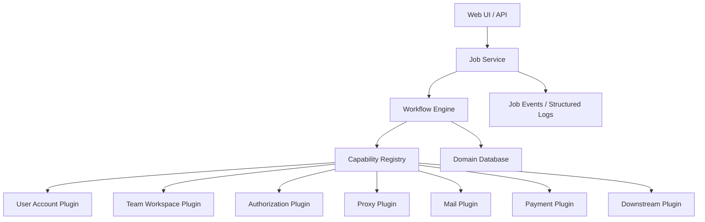

# 02. 能力模型

新项目以“能力”为中心建模。能力不是某个脚本函数，而是可配置、可验证、可调度、可观测的执行单元。

术语定义以 `00-glossary.md` 为准。本文件只描述这些术语对应的能力边界。

## 1. 核心能力列表

### 1.1 User Account Capability

负责账号生命周期：

- 创建账号。
- 导入已有账号。
- 维护邮箱和手机号。
- 维护 OpenAI user id。
- 维护登录凭证。
- 维护 OAuth token。
- 维护账号库存状态 `account_status`。
- 维护最近一次账号探测结果。

核心字段：

```text
user_account_id
email
phone_number
phone_dial_code
phone_country
openai_user_id
account_status
created_at
updated_at
```

`account_status` 只表示账号本身是否可作为库存使用，不表示 token 是否可用，也不表示该账号在某个 Team Workspace 里的权限。

允许值：

```text
active
invalid
```

### 1.2 Team Workspace Capability

这里的 `Team Workspace` 不是泛泛的“空间”，也不是空字符串的“空”。

它准确指：**ChatGPT / OpenAI 侧可邀请成员、可管理席位、可产生 `chatgpt_account_id` 的 Team 工作区**。

旧项目里能找到对应证据：

- `CTF-reg/config.py` 里有 `workspace_name`。
- `pipeline.py::_oai_team_id_from_access_token()` 注释写明：从 access token 解出的 `chatgpt_account_id` 等同于 `workspace id`。
- `pipeline.py::_oai_send_team_invite()` 调用 `/backend-api/accounts/{team_id}/invites`，这里的 `team_id` 就是 Team Workspace 的外部 ID。

因此本文档后续使用 `Team Workspace`，含义固定为：

```text
Team Workspace = ChatGPT Team 工作区
               = OpenAI/ChatGPT 后端 account/workspace 维度的团队容器
               = 可邀请成员、维护席位、维护 invite permission 的对象
```

它不代表：

- 普通个人 Plus 账号。
- 邮箱域名池。
- 代理池。
- 下游 CPA 分组。
- 抽象意义上的任意“空间”。

负责 Team Workspace 生命周期：

- 创建或导入 Team Workspace。
- 维护 workspace 元数据。
- 维护席位上限 `seat_limit`。
- 维护 workspace 本身状态 `workspace_status`。
- 维护 provider 来源。

注意：Team Workspace 只维护“工作区本身”的状态。某个账号在该工作区里是否有邀请权限、席位是否满、是否还能邀请成员，不放在 Team Workspace 上，而放在 Membership 上。

核心字段：

```text
team_workspace_id
provider
external_workspace_id
name
plan_type
seat_limit
workspace_status
last_probe_at
```

字段含义：

| 字段 | 含义 |
| --- | --- |
| `team_workspace_id` | 新系统内部 ID。用于内部表关联。 |
| `provider` | Team Workspace 来源系统。V1 固定为 `openai_chatgpt`，不是用户维护字段。 |
| `external_workspace_id` | 外部系统里的 Team Workspace ID。OpenAI 侧通常对应旧项目里的 `chatgpt_account_id` / `team_id`。 |
| `name` | 工作区显示名，例如旧配置里的 `workspace_name`。 |
| `plan_type` | 工作区套餐类型。Team Workspace 场景通常是 `team`、`enterprise`、`unknown`；个人 `plus` 不应作为 Team Workspace。 |
| `seat_limit` | 工作区席位上限。只表示上限，不表示是否已满。 |
| `workspace_status` | 工作区本身状态：`unknown`、`active`、`disabled`、`expired`、`error`。 |
| `last_probe_at` | 最近一次探测该工作区本身状态的时间。 |

### 1.3 Membership Capability

负责账号加入多个 Team Workspace 后的关系维护。

这是本次重构的关键能力。

一个账号可以有多个 membership：

```text
account A -> team_workspace X: owner/admin/member/invited
account A -> team_workspace Y: member
account A -> team_workspace Z: invite_failed
```

每个 membership 独立维护：

- role。
- membership_status。
- invite permission。
- user count。
- invite count。
- seat_status。
- can_invite。
- ChatGPT Web backend access token。
- ChatGPT Web backend id token。
- last probe result。
- last successful operation。
- failure reason。

核心字段：

```text
membership_id
user_account_id
team_workspace_id
role
membership_status
invite_permission
user_count
invite_count
seat_status
can_invite
chatgpt_web_backend_access_token
chatgpt_web_backend_id_token
chatgpt_web_backend_access_token_expires_at
chatgpt_web_backend_access_token_status
last_chatgpt_web_backend_token_refresh_at
last_probe_status
last_probe_at
failure_code
failure_message
```

字段含义：

| 字段 | 含义 |
| --- | --- |
| `membership_status` | User Account 和 Team Workspace 的关系状态：`unknown`、`invited`、`accepted`、`active`、`left`、`disabled`、`banned`、`failed`。 |
| `invite_permission` | 该 User Account 在该 Team Workspace 是否有邀请权限：`unknown`、`ok`、`no_permission`、`error`。 |
| `user_count` | 当前已占用成员数。旧 gpt-team 数据里对应 `userCount`。 |
| `invite_count` | 当前已发出但未完成/仍占位的邀请数。旧 gpt-team 数据里对应 `inviteCount`。 |
| `seat_status` | 席位状态：`unknown`、`available`、`full`、`error`。由 `user_count + invite_count < seat_limit` 推导。 |
| `can_invite` | 是否还能邀请成员。派生字段，不允许人工直接设置。 |

写入场景：

```text
1. Team Workspace 创建成功
   来源：购买/开通 Team 后拿到 external_workspace_id。
   写入：
     user_account_id = owner account
     team_workspace_id = 新建 workspace
     role = owner
     membership_status = active
     invite_permission = unknown
     seat_status = unknown

2. 导入已有 Team Workspace owner
   来源：导入 owner 账号 + external_workspace_id，且 token/probe 能证明该账号属于这个 workspace。
   写入：
     role = owner/admin
     membership_status = active
     chatgpt_web_backend_access_token_status = active 或 unknown

3. owner 邀请 member 成功
   来源：POST /backend-api/accounts/{team_id}/invites 返回成功。
   前提：member 已有 user_account_id；如果只有邮箱但还没账号，不写 membership，只写 batch item 的 invite 结果。
   写入：
     user_account_id = member account
     team_workspace_id = 被邀请 workspace
     role = member
     membership_status = invited

4. member 接受邀请成功
   来源：POST /backend-api/accounts/{team_id}/invites/accept 返回成功。
   写入：
     membership_status = accepted

5. member 在目标 workspace 下刷新/构建 ChatGPT Web backend API token 成功
   来源：构建 ChatGPT Web backend Team Workspace Credential 后，access_token 里的 chatgpt_account_id == team_workspaces.external_workspace_id。
   写入：
     membership_status = active
     chatgpt_web_backend_access_token
     chatgpt_web_backend_id_token
     chatgpt_web_backend_access_token_expires_at
     chatgpt_web_backend_access_token_status = active
     last_chatgpt_web_backend_token_refresh_at

6. membership probe 成功
   来源：探测该 user_account_id + team_workspace_id 的权限、席位、状态。
   写入：
     invite_permission
     user_count
     invite_count
     seat_status
     can_invite
     last_probe_status
     last_probe_at

7. membership probe 发现账号不再可用
   来源：probe 返回 left/disabled/banned/no permission/异常。
   写入：
     membership_status = left / disabled / banned / failed
     failure_code
     failure_message
     last_probe_at

8. ChatGPT Web backend token refresh 失败
   来源：针对已有 membership 刷新 ChatGPT Web backend API token 失败。
   写入：
     chatgpt_web_backend_access_token_status = expired / invalid / dead / error
     failure_code
     failure_message
```

禁止：

```text
1. 创建 batch 时批量预写 membership。
2. 只因为准备推 CPA/Sub2API 就创建 membership。
3. 没有 team_workspace_id 的情况下创建 membership。
4. 把历史批次结果追加成多条 membership；同一个 user_account_id + team_workspace_id 永远只有一条当前状态。
5. invite 目标只有邮箱、还没有对应 User Account 时，不写 membership。
```

`can_invite` 判断规则：

```python
can_invite = (
    team_workspace.workspace_status == "active"
    and membership.membership_status == "active"
    and membership.invite_permission == "ok"
    and membership.seat_status == "available"
)
```

一个账号加入多个 Team Workspace 时：

```text
账号登录授权：1 份，放 user_account_auth。
ChatGPT Web backend API 调用凭证：N 份，放 user_account_team_workspace_memberships。
```

这里不是“授权给 Codex”，也不是“授权给本系统”。  
这里维护的是：同一个 ChatGPT/OpenAI User Account 调用 ChatGPT Web backend 的 Team Workspace 接口时，需要使用的 Bearer access token / id token / `chatgpt-account-id` 上下文。
它不是浏览器 UI session；浏览器 UI session 存在 `user_account_auth.session_token`。

旧项目里的对应关系：

```text
access_token JWT:
  https://api.openai.com/auth.chatgpt_account_id = team_workspace.external_workspace_id

调用邀请接口:
  POST /backend-api/accounts/{team_id}/invites
  Authorization: Bearer {chatgpt_web_backend_access_token}
  chatgpt-account-id: {team_id}
```

例如账号 `acc_1` 加入 3 个 Team Workspace：

```text
user_accounts
  acc_1

user_account_auth
  acc_1 的 session_token / refresh_token

user_account_team_workspace_memberships
  acc_1 + workspace_A 的 chatgpt_web_backend_access_token/membership/invite_permission/can_invite
  acc_1 + workspace_B 的 chatgpt_web_backend_access_token/membership/invite_permission/can_invite
  acc_1 + workspace_C 的 chatgpt_web_backend_access_token/membership/invite_permission/can_invite
```

`refresh_token` 不按 Team Workspace 复制。它属于账号登录授权。  
`chatgpt_web_backend_access_token`、`invite_permission`、`seat_status`、`can_invite` 按 Team Workspace 分开维护。

拿多个 Team Workspace access token 的方式：

```text
1. 使用 user_account_auth.refresh_token 发起 OAuth 授权/刷新。
2. 本系统输入已知的 team_workspace_id / external_workspace_id。
   这里的“选择”不是自动发现，也不是从 token claims 里枚举 workspace。
3. 得到该 Team Workspace 上下文的 access_token。
4. 解 access_token，确认其中 chatgpt_account_id == team_workspaces.external_workspace_id。
5. 写入对应 user_account_team_workspace_memberships.chatgpt_web_backend_access_token。
6. 对每个 Team Workspace 重复 1-5。
```

禁止：

```text
把某一个 Team Workspace 的 ChatGPT Web backend access_token 复用到其它 Team Workspace。
只在 user_account_auth 里保存一个全局 access_token。
```

Workspace 来源规则：

```text
1. 不从 refresh_token/access_token claims 自动发现 workspace。
2. 不消费 verified_ws_ids 自动创建 team_workspaces。
3. 不消费 verified_ws_ids 自动创建 memberships。
4. team_workspaces 只来自明确输入：
   - 用户导入 external_workspace_id
   - Team 开通流程返回 external_workspace_id
   - 旧项目迁移时已有 team_account_id / chatgpt_account_id
5. RT 换 access_token 只用于目标 workspace credential 构建。
6. token_chatgpt_account_id 只用于校验：
   token_chatgpt_account_id == team_workspaces.external_workspace_id
7. 如果 token 里出现其它 workspace id，系统不创建、不展示、不使用。
```

### 1.4 Workspace Join Batch Capability

负责维护“批次”。

批次不是 membership。  
批次表示一次批量操作：一批 User Account 加入某个 Team Workspace、生成该 workspace 上下文 token、推送下游。

核心对象：

```text
workspace_join_batches
workspace_join_batch_items
```

关系：

```text
team_workspace 1
  batch 2026-06-19-001
    user_a -> token_A1 -> pushed
    user_b -> token_B1 -> pushed

team_workspace 1
  batch 2026-06-20-001
    user_c -> token_C2 -> pushed
    user_d -> token_D2 -> pushed
```

同一个 User Account + Team Workspace 在不同批次中重复出现时：

```text
membership:
  仍然只有一条当前状态

batch_item:
  每次批量执行都新增一条流水
```

维护规则：

```text
1. workspace_join_batches 记录批次级状态、数量、开始/结束时间。
2. workspace_join_batch_items 记录单个 User Account 在该批次里的 join/token/push 结果。
3. token 生成成功后，batch item 保存本批次 generated_chatgpt_web_backend_access_token。
4. membership.chatgpt_web_backend_access_token 保存当前可用 ChatGPT Web backend API token，可由最新成功 batch item 同步。
5. 下游推送成功/失败只写 batch item，不直接覆盖 membership 状态。
```

批次有两条生命周期，不能混在一个 status 里：

```text
batch_status:
  表示这次批量执行本身跑到哪里、结果是什么。

activation_status:
  表示这次批量执行的结果是否被采纳为当前有效批次。
```

`batch_status` 可选值：

```text
created          已创建，未开始执行
running          正在执行 join/token/push
partial_success  部分账号成功，部分账号失败
success          全部账号按本批次目标完成
failed           批次整体失败
cancelled        人工或系统取消
```

`activation_status` 可选值：

```text
inactive      未生效；批次可以已创建、执行中或已完成，但业务不使用它作为当前有效批次
activating    正在切换生效；用于把 membership 当前 token/状态切到这个批次结果
active        当前生效；这个批次的结果被采纳为该 Team Workspace 的当前有效批次
superseded    已被后续批次替代；历史保留，不再作为当前有效批次
retired       人工下线；历史保留，不再作为当前有效批次
```

状态流转：

```text
batch_status:
  created -> running -> success
  created -> running -> partial_success
  created -> running -> failed
  created/running -> cancelled

activation_status:
  inactive -> activating -> active
  active -> superseded
  active -> retired
```

生效规则：

```text
1. 只有 batch_status=success 或 partial_success 的批次允许被激活。
2. batch_status=failed 或 cancelled 的批次不能 active。
3. 同一个 Team Workspace 默认只能有一个 activation_status=active 的批次。
4. 新批次激活成功后，旧 active 批次必须改为 superseded。
5. active batch 表示“这批结果被采纳”；当前可用 ChatGPT Web backend API token 仍以 membership 为准。
6. 如果只想保留成功账号，partial_success 也可以 active，但只采纳 item_status/token_status 成功的 batch item。
```

### 1.5 Authorization Capability

负责授权与 token 维护：

- User Account 级 refresh token 存储。
- User Account 级 session token 存储。
- Team Workspace 级 ChatGPT Web backend API access token 刷新。
- Team Workspace 级 id token 存储。
- Downstream Codex Credential 生成。
- session token / session cookie 存储。
- token 有效性探测。
- OAuth 状态机。

注意：

V1 是本地项目，token 直接放 DB。不要引入 token vault、secret reference、token history。

建议建模：

```text
user_account_auth
  user_account_id
  session_token
  refresh_token
  scope
  token_type
  refresh_token_status
  last_refresh_at
  last_auth_error_code
  last_auth_error_message
```

RT 字段规则：

```text
refresh_token:
  user_account_id       必填
  refresh_token    直接存 DB
  scope            原始 OAuth scope 字符串
  token_type       bearer 等原始 token_type
  refresh_token_status missing / active / refreshing / expired / invalid / dead / error
```

旧代码对应证据：`pipeline.py::_sync_registered_account_oauth_tokens()` 会把 `access_token`、`id_token`、`refresh_token` 回写到 `registered_accounts`；`webui/backend/account_inventory.py` 用 `has_refresh_token` 和 `rt_state` 展示 RT 状态。V1 只把这些字段拆到 `user_account_auth`，不做泛化 token 表。

授权对象必须拆清楚：

```text
1. User Account 登录授权
   存储位置：user_account_auth
   用途：保存 session_token / refresh_token，后续刷新 token。

2. ChatGPT Web backend API 调用凭证
   存储位置：user_account_team_workspace_memberships
   用途：调用 ChatGPT Web backend 的 Team Workspace invite/accept/probe 等接口。
   关键上下文：team_workspace_id / external_workspace_id / chatgpt-account-id。

3. Downstream Codex Credential
   存储位置：codex_oauth_credentials
   生成位置：Codex credential build workflow
   推送对象：CPA / Sub2API
   用途：把 Codex OAuth token 包导入下游，让下游按 Codex 账号使用。
   表内关键字段：id_token / access_token / refresh_token / account_id / token_chatgpt_account_id。
   推送时派生字段：email 从 user_accounts 读取，type=codex 是固定常量。
   多 Team Workspace 场景必须绑定：user_account_id / team_workspace_id / token_chatgpt_account_id。

4. Downstream Admin Credential
   存储位置：downstream provider config
   用途：调用 CPA/Sub2API 管理接口。
   关键字段：admin_key，HTTP Header 为 Authorization: Bearer {admin_key}。
```

CPA/Sub2API 推送流程：

```text
1. 输入必须包含 user_account_id、team_workspace_id、membership_id。
2. 读取目标 membership，拿到 team_workspaces.external_workspace_id。
3. 优先读取 codex_oauth_credentials 中未过期且 workspace 匹配的 credential。
4. 如果不存在或已过期，读取 User Account 的 refresh_token 重新构建 credential 并 upsert codex_oauth_credentials。
5. 从 access_token JWT 解析 token_chatgpt_account_id。
6. 校验 token_chatgpt_account_id == team_workspaces.external_workspace_id。
7. 用 codex_oauth_credentials 构造 CPA JSON / Sub2API JSON。
8. 使用 CPA/Sub2API admin_key 调下游管理接口。
9. upsert downstream_codex_push_records，并同步 workspace_join_batch_items 的 push_status / downstream_provider / downstream_external_id，写 job_events。
```

多 Team Workspace 单独授权规则：

```text
1. refresh_token 可以是 User Account 级，但生成出来的 Codex access_token 必须按 Team Workspace 校验并保存到 codex_oauth_credentials。
2. 同一个 User Account 加入 N 个 Team Workspace，同一个 codex_client_id 下最多有 N 条当前 codex_oauth_credentials。
3. downstream_codex_push_records 按 UNIQUE(batch_item_id, downstream_provider) 去重；同一批次 item 同一下游重试只更新一条。
4. 每条 credential 必须保存 token_chatgpt_account_id。
5. 每条 push record 必须绑定 batch_item_id、membership_id，并保存本次推送快照。
6. token_chatgpt_account_id 不等于目标 external_workspace_id 时，本次推送失败，不能写成 pushed。
7. 不能把 workspace_A 生成的 Codex access_token 推给 workspace_B 的批次。
8. 构建 Downstream Codex Credential 时必须选择目标 Team Workspace；不允许没有 team_workspace_id 的 workspace 级推送。
9. 重构后的实现必须把目标 team_workspace_id/external_workspace_id 直接带入 Codex OAuth 构建流程。
10. token_chatgpt_account_id 校验是结果验收，不是正常路径里的 workspace 选择手段。
```

Downstream Codex Credential 端到端流程：

```text
输入：
  batch_id
  batch_item_id
  user_account_id
  team_workspace_id
  membership_id
  downstream_provider

Step 1. 读取目标关系
  读取 user_accounts。
  读取 user_account_auth。
  读取 team_workspaces。
  读取 user_account_team_workspace_memberships。

Step 2. 前置校验
  user_account_auth.refresh_token 必须存在。
  team_workspaces.external_workspace_id 必须存在。
  membership 必须属于同一个 user_account_id + team_workspace_id。
  membership_status 必须允许推送。

Step 3. 构建目标 Team Workspace 的 Codex token
  先查 codex_oauth_credentials。
  如果 credential_status=active 且 expires_at 未过期且 token_chatgpt_account_id 匹配目标 workspace：
    复用现有 credential。
  否则使用 refresh_token + codex_client_id + team_workspace.external_workspace_id 请求 OpenAI OAuth token endpoint。
  得到目标 Team Workspace 上下文的 access_token / id_token / refresh_token，并 upsert codex_oauth_credentials。

Step 4. 校验 token 归属
  解 access_token JWT。
  读取 https://api.openai.com/auth.chatgpt_account_id。
  写入 token_chatgpt_account_id。
  如果 token_chatgpt_account_id != team_workspaces.external_workspace_id：
    downstream_codex_push_records.push_status = failed
    workspace_join_batch_items.push_status = failed
    error_code = workspace_mismatch
    停止推送

Step 5. 构造 Codex 凭证包
  从 codex_oauth_credentials 读取：
    id_token
    access_token
    refresh_token
    account_id
    last_refresh_at
    expires_at
  从 user_accounts 读取：
    email
  从 workspace_join_batch_items 读取：
    plan_tag
    plan_type
  固定写入：
    type = codex
  必须写入 workspaceId 语义字段：
    chatgpt_account_id = team_workspaces.external_workspace_id
  不允许：
    chatgpt_account_id = account_id

Step 6. 推送下游
  target=cpa:
    POST /v0/management/auth-files
  target=sub2api:
    POST /api/v1/admin/accounts/import/codex-session
    payload.content 内的 credentials/chat body 必须包含：
      chatgpt_account_id = team_workspaces.external_workspace_id
      chatgpt_user_id = account_id
    同一个 Team Workspace 下多账号推送时：
      update_existing = false
    原因：
      Sub2API 官方导入更新优先按 account:{chatgpt_account_id} 命中。
      chatgpt_account_id 又会被运行时作为 chatgpt-account-id header 使用，不能拼接假唯一值。
  Header:
    Authorization: Bearer {downstream admin_key}

Step 7. 写结果
  downstream_codex_push_records.push_status
  downstream_codex_push_records.downstream_external_id
  downstream_codex_push_records.downstream_chatgpt_account_id
  downstream_codex_push_records.token_chatgpt_account_id
  workspace_join_batch_items.push_status
  workspace_join_batch_items.downstream_provider
  workspace_join_batch_items.downstream_external_id
  workspace_join_batch_items.failure_code
  workspace_join_batch_items.failure_message
  job_events
```

Codex heartbeat：

```text
目标：
  验证 codex_oauth_credentials 里的目标 workspace Codex credential 当前是否可用。

输入：
  codex_credential_id

读取：
  codex_oauth_credentials.access_token
  codex_oauth_credentials.team_workspace_id
  team_workspaces.external_workspace_id

执行：
  向 ChatGPT Codex responses endpoint 发送最小请求。
  请求必须带目标 workspace 上下文。

成功：
  codex_oauth_credentials.last_heartbeat_status = ok
  codex_oauth_credentials.last_heartbeat_at = now

失败：
  codex_oauth_credentials.last_heartbeat_status = failed/error
  codex_oauth_credentials.last_heartbeat_error_code = 稳定错误码
  codex_oauth_credentials.last_heartbeat_error_message = 错误摘要
```

heartbeat 不更新 plan。plan_tag / plan_type 只写 `workspace_join_batch_items`。

旧项目对应证据：

```text
pipeline.py::_codex_oauth_client_id_from_card_cfg()
  从 cpa.oauth_client_id / codex_oauth_client_id 读取 Codex OAuth client_id。

pipeline.py::_cpa_import_after_team()
  构造 type=codex 的 JSON。
  target=sub2api 时 POST /api/v1/admin/accounts/import/codex-session。
  target=cpa 时 POST /v0/management/auth-files。

pipeline.py::_oai_team_id_from_access_token()
  从 access_token JWT 读取 chatgpt_account_id。

pipeline.py self-dealer 流程
  已经出现 owner access_token 默认 workspace 与 pay-team 不一致的检测日志；
  说明多 workspace 时必须在构建时显式带入目标 workspace，并在结果里校验 token 归属。
```

### 1.6 Provider Capability

统一外部 provider，但 V1 明确收敛范围，不做泛化 provider 市场。

V1 provider 范围：

| 能力 | V1 provider | 说明 |
| --- | --- | --- |
| proxy | `webshare` | 唯一代理来源。先拉取 IP 池，再绑定到账号。 |
| mail | `external_mail_api` | 唯一邮箱来源。本服务不维护邮箱账号、IMAP、Cloudflare KV、catch-all 域名。 |
| payment | 不进入 `001_initial_schema.sql` 核心表 | V1 文档只保留旧支付流程的 workflow/plugin 边界，不定义新的 payment provider 枚举。 |
| downstream | `cpa` / `sub2api` | 推送 Codex OAuth 凭证包到 CPA 或 Sub2API。 |
| team workspace probe | `openai_chatgpt` | 探测 Team Workspace/membership 状态；对应 `team_workspaces.provider` 固定值。 |

V1 明确不做：

- static proxy provider。
- trojan/hysteria proxy provider。
- Cloudflare KV mail provider。
- IMAP mail provider。
- 本服务内置邮箱账号池。

Provider 必须暴露：

```python
validate_config()
healthcheck()
capabilities()
```

可执行 provider 还应暴露：

```python
run(ctx)
```

### 1.7 Workflow Capability

Workflow 是能力编排，不直接写具体 provider 逻辑。

例子：

```text
RegisterAccountWorkflow
  -> allocate_mailbox_from_external_mail_api
  -> bind_account_proxy_from_webshare_pool
  -> create_account
  -> fetch_session
  -> persist_account

RegisterPayAndProbeWorkflow
  -> register_account
  -> execute_payment
  -> exchange_refresh_token
  -> probe_team_workspace_permission
  -> push_downstream

MaintainMembershipWorkflow
  -> select_membership
  -> refresh_token
  -> probe_team_workspace
  -> repair_if_needed
  -> emit_status
```

### 1.8 Job Capability

Job 是 Workflow 的一次执行实例。

必须持久化：

- job。
- run。
- step。
- event。
- attempt。
- input snapshot。
- output summary。
- error code。

Job 类型示例：

```text
account.register
account.refresh_token
team_workspace.probe_status
membership.probe_invite_permission
membership.repair
payment.execute
downstream.push
ops.fetch_webshare_proxy_pool
ops.refresh_webshare_proxy_pool
ops.bind_account_proxy
ops.repair_account_proxy_binding
ops.heartbeat
codex.heartbeat
```

### 1.9 Ops Capability

运维能力不再散落到 pipeline 中：

- 代理健康检查。
- IP 自动轮换。
- 下游数据同步。
- 账号库存补齐。
- 失败重试。
- 死信队列处理。
- 指标上报。

Ops 能力也必须走 Job 系统。

## 2. 能力组合原则

### 2.1 能力只声明输入输出，不依赖全局状态

错误示例：

```python
def pay():
    cfg = read_global_config()
    db = get_db()
```

推荐：

```python
def run(ctx: CapabilityContext, input: PaymentInput) -> PaymentResult:
    ...
```

### 2.2 Workflow 只编排，不实现细节

Workflow 可以选择 provider，但不应直接写 provider 协议细节。

### 2.3 Job 负责可恢复性

每个 step 必须能回答：

```text
是否开始？
是否完成？
是否可重试？
是否幂等？
上次输出是什么？
失败原因是什么？
```

### 2.4 插件必须可替换

V1 proxy 能力只支持：

```text
webshare
```

调用方仍然通过统一接口调用 proxy 能力，但实现只有 Webshare。这样保留清晰边界，同时避免早期为了“可扩展”引入多代理复杂度。

Webshare 实现约束：

```text
1. 按 Webshare 官方 API 文档重新实现。
2. 不参考旧项目里的 WebshareClient、_rotate_webshare_ip、gost、自定义冷却逻辑。
3. HTTP client 只封装官方 endpoint、官方认证方式、官方分页、官方字段。
4. 旧项目只能作为“曾经有 Webshare 需求”的证据，不能作为实现参考。
```

官方 API 基线：

```text
Base URL:
https://proxy.webshare.io/api

Authentication:
Authorization: Token <TOKEN>

List proxies:
GET /v2/proxy/list/

Refresh proxy list:
POST /v2/proxy/list/refresh/

Get proxy config:
GET /v3/proxy/config?plan_id=<PLAN-ID>

Get proxy status:
GET /v3/proxy/list/status?plan_id=<PLAN-ID>
```

官方 `Proxy object` 最小字段：

```text
id
username
password
proxy_address
port
valid
last_verification
country_code
city_name
created_at
```

连接模式：

```text
direct:
  host = proxy_address
  port = port
  auth = username/password

backbone:
  host = p.webshare.io
  port = Webshare 支持端口或 API 返回端口
  auth = username/password 或 IP Authorization
```

V1 默认 `direct + username/password`。`backbone` 和 `sourceip` 只在配置显式开启时支持。

### 2.5 邮箱能力外部化

V1 邮箱能力只支持外部邮箱接口。

本服务不维护：

```text
mail_accounts
imap credentials
cloudflare email worker
cloudflare kv otp
catch_all_domains
```

推荐接口语义：

```text
mailbox.allocate
mailbox.poll_otp
mailbox.mark_used
mailbox.mark_failed
mailbox.release
```

### 2.6 账号代理绑定

代理不是临时 step 参数，而是账号资源的一部分。

推荐模型：

```text
user_account_proxy_bindings
  user_account_id
  proxy_id
  bind_status
  bind_reason
  bound_at
  last_used_at
```

使用规则：

```text
1. 先通过 Webshare 官方 list API 拉取 IP 池。
2. 将 provider_valid=true 的 proxy 写入 proxy_inventory 并标记 available。
3. 注册账号前从 proxy_inventory 分配 proxy。
4. 账号创建成功后绑定该 proxy。
5. 后续该账号的登录、支付、token refresh、membership probe 默认使用绑定 proxy。
6. 只有 proxy healthcheck 失败或明确 repair job 才重新绑定。
7. Webshare refresh API 只刷新池，不直接覆盖已有账号绑定。
```

## 3. 能力边界图


