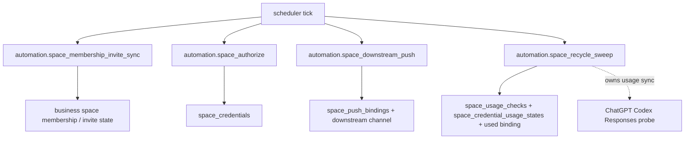
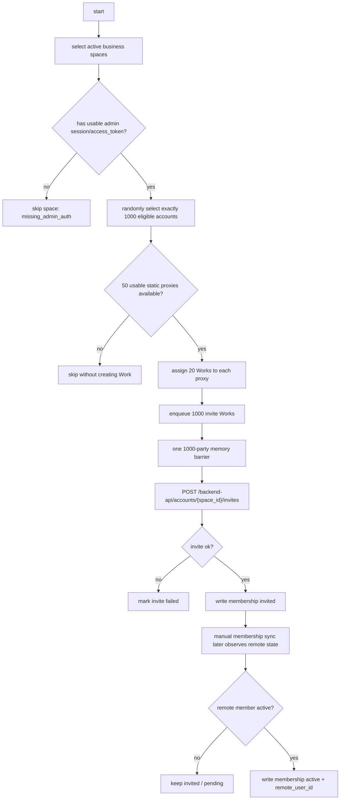
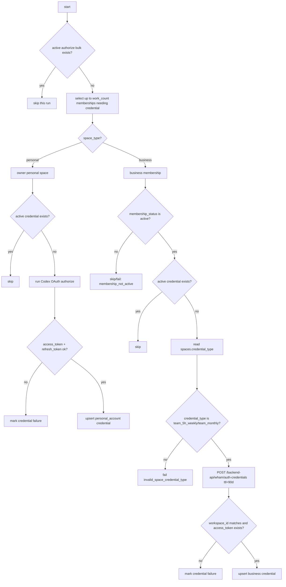
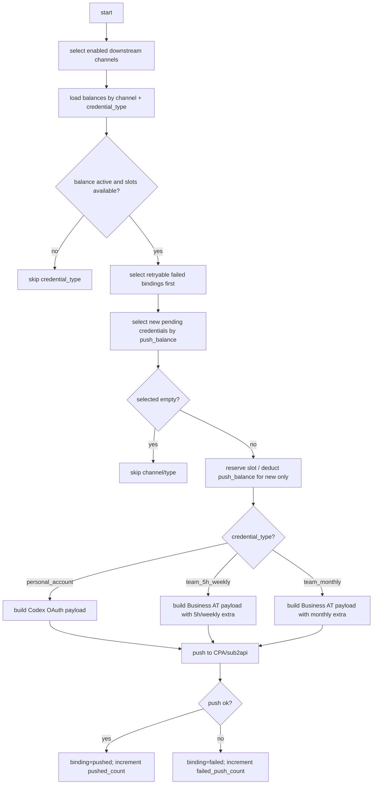
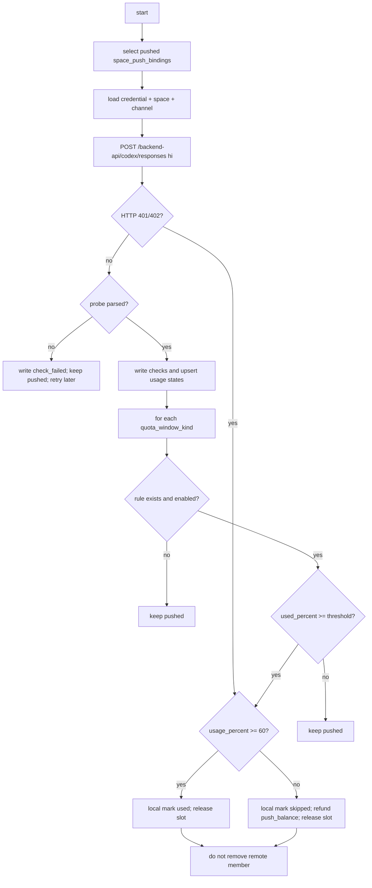

# 17. Space 授权、推送、回收流程重构设计

本文档固化新的 Space 模型。核心原则：

```text
系统只有一套授权、推送、余额、用量、回收逻辑：Space 逻辑。
不存在第二套并行逻辑。
不存在过渡期。
不存在“旧逻辑继续跑、新逻辑补充跑”的双轨状态。
所有可执行入口、job、API、Portal 页面只能落到 Space 表和 Space 流程。
历史表名/历史字段名只作为“必须删除或改造的对象”出现，不能作为运行路径。
生产代码里不能保留可被调度、可被路由、可被 job 调用的旧逻辑。
生产代码里也不能保留旧逻辑死代码、备用分支、兼容 route、兼容 job、兼容 workflow。
实现时不使用“旧逻辑 / 新逻辑”双口径描述；运行时只有 Space 这一套口径。
只有一张空间表。
现有 team_workspaces 直接改造成 spaces。
不新增第二张相似空间表。
个人空间也是 Space。
凭证当前态统一按 user_account_id + space_id 唯一。
Personal Space 只有 owner 参与授权，因此自然只有 owner + personal_space 这一条当前凭证。
Business Space 下每个成员账号可以各有一条 member + business_space 当前凭证。
```

## 0. 已确认需求

以下内容来自当前讨论，作为本设计输入：

```text
1. 每个账号都有个人空间。
2. 账号完成 Codex 授权后，等价于授权该账号自己的个人空间。
3. Business 空间授权不再走 Codex RT。
4. Business 空间登录后拿 session，再调用后台接口创建 access_token。
5. Business access_token 只有 access_token，没有 refresh_token。
6. 暂不考虑 Business access_token 过期刷新。
7. Payload 按 spaces.credential_type 区分。
8. personal_account 复用现有 Codex OAuth payload；team_5h_weekly / team_monthly 使用 Business access token payload。
9. sub2api / CPA 的 Business access token payload 使用 personal access token 导出格式；CPA 与 sub2api 同一格式。
10. 空间额度窗口识别接口已从 HAR 确认为 GET /backend-api/wham/usage。
    该接口只允许在创建/导入 business space 时识别 spaces.credential_type；不属于 4 个长期定时 job。
11. 推送状态和推送量按凭证区分。
12. 下游渠道余额按 downstream_channel + credential_type 维护，不按单条凭证维护。
13. OpenAI 额度用量按 spaces.credential_type + quota_window_kind 维护。
14. 回收规则按 spaces.credential_type + quota_window_kind 区分。
15. 当前没有需要保留的数据。
16. Team / Business 成员、席位、邀请能力仍需要保留。
17. 没有过渡期。
18. 当前凭证分三类：
    - personal_account
    - team_5h_weekly
    - team_monthly
19. 推送量按凭证维护：一条 space_credentials 一份推送量。
20. credential_type 决定 payload、额度窗口和回收规则。
21. personal_account 达到阈值后标记为 used，后续不再推送。
22. Space 回收不剔除远端成员，只标记本地 used，后续不再推送。
23. Space 回收不创建远端剔除任务，不暴露远端剔除开关。
24. team_monthly 的 monthly 达到阈值后标记为 used。
25. team_monthly 额度识别按 HAR usage 窗口规则实现。
```

## 1. 重新定义 Space

### 1.1 Space

`Space` 是系统内唯一空间对象。

```text
Space = 可授权、可推送、可计量、可回收、可展示的空间
```

### 1.1.1 三类计量概念

```text
下游渠道类型容量:
  字段: downstream_channel_credential_type_balances.push_balance
  字段: downstream_channel_credential_type_balances.max_active_slots
  含义: CPA / sub2api 等下游渠道对某类凭证还能接收多少推送、最多占用多少活跃坑位。
  维度: downstream_channel_id + credential_type。

OpenAI 额度用量:
  Space 类型识别来源: GET /backend-api/wham/usage，仅限创建/导入 business space 时使用
  回收判断来源: 复用旧心跳逻辑，直接用该 credential 调 ChatGPT Codex Responses 发最小 hi 请求。
  字段: codex_5h_used_percent / codex_7d_used_percent / codex_primary_used_percent / codex_secondary_used_percent / monthly 等归一化字段。
  存储: space_credential_usage_states
  维度: space_credential_id + quota_window_kind。

推送量:
  字段: space_push_bindings.pushed_count / failed_push_count / used_count
  含义: 某条凭证被推送、失败、标记用完的次数。
  维度: space_credential_id。
```

空间类型：

```text
personal  账号自己的个人空间
business  Team / Business 空间
```

### 1.2 Team Workspace 的位置

`team_workspaces` 不作为运行表保留。目标态只有 `spaces` 一张空间表。

处理方式：

```text
team_workspaces 表重命名 / 改造成 spaces。
Team Workspace 不再是表名。
Team Workspace 只是 business space 的成员、席位、邀请能力。
```

也就是说：

```text
spaces WHERE space_type = 'business'
```

### 1.3 单逻辑落地边界

本次重构目标态没有旧入口、旧 job、旧页面继续参与运行。

```text
允许保留的是“动作能力”：
  登录
  session 探测
  personal Codex OAuth 授权动作
  business 后台 access_token 创建动作
  business 成员邀请 / 同步动作

不允许保留的是“旧主模型 / 旧调度逻辑”：
  team_workspace 作为空间主模型
  codex_oauth_credentials 作为凭证主模型
  downstream_codex_push_records 作为推送主模型
  remote_member_release_tasks 作为回收主模型
  workspace_join_batches 同时承载授权、token、推送
```

换句话说：

```text
Codex OAuth 只能是 personal_account 的授权动作。
授权结果必须写入 space_credentials。
Business access_token 创建只能是 business credential 的授权动作。
授权结果也必须写入 space_credentials。
推送只能读取 spaces + space_credentials + space_push_bindings。
回收只能读取 Space 模型，并现场执行旧 Codex Responses probe 得到当前凭证状态。
回收阶段不直接调用 wham/usage。
```

## 2. 只允许一套 Space 主逻辑

以下对象不能作为运行主模型；实现时必须删除，或者原地改造成 Space 口径。
不接受“旧逻辑先保留、Space 逻辑另起一套”的实现。
不接受“先留着但不调用”的实现。只要代码仍在生产入口文件、job 注册、workflow 模块、ORM model 或 API route 中，就视为没有完成单套逻辑改造。

```text
team_workspaces 独立表
codex_oauth_credentials 授权主表
downstream_codex_push_records 推送主表
remote_member_release_tasks 回收/剔除主表
team_workspace_id 作为授权 / 推送目标字段
codex_credential_id 作为推送目标字段
downstream_push_record_id 作为回收目标字段
```

禁止关系：

```text
spaces -> team_workspaces
personal space -> membership
business space -> codex_oauth_credentials
同一个 user_account + space 出现多条当前授权
Business access_token -> refresh_token
Business payload -> DownstreamCodexPayload
```

代码落地判定：

```text
1. API 只能暴露 Space 口径 route。
2. job handlers 只能注册 Space 口径 job。
3. workflow 模块只能保留 Space 口径授权、推送、用量、回收流程。
4. ORM metadata 不能包含旧授权、旧推送、旧回收主表。
5. 前端页面和导航不能出现旧 batch / workspace join / codex credential / downstream push record 入口。
6. 测试不能通过旧 route 或旧 workflow 证明功能，只能通过 Space route / Space workflow 证明功能。
```

```text
1. 运行入口只有 Space 入口。
2. API route 不暴露旧路径。
3. Job type 不注册旧类型。
4. 前端页面不调用旧接口。
5. workflow / service 不以旧表作为主模型读写。
6. SQLAlchemy Base.metadata 不映射旧运行表。
7. 旧名称只允许出现在 migration/drop、历史备份、文档说明、测试断言中。
```

## 3. 表设计

### 3.1 user_accounts

`user_accounts` 是账号基本信息表。账号密码属于账号基本信息，直接放在
`user_accounts`，不再单独设计 `user_account_auth`。

```sql
CREATE TABLE user_accounts (
  id TEXT PRIMARY KEY,
  email TEXT NOT NULL,
  password TEXT NOT NULL DEFAULT '',
  phone_number TEXT NOT NULL DEFAULT '',
  phone_dial_code TEXT NOT NULL DEFAULT '',
  phone_country TEXT NOT NULL DEFAULT '',
  openai_user_id TEXT NOT NULL DEFAULT '',
  account_status TEXT NOT NULL CHECK (
    account_status IN ('active', 'invalid')
  ),
  session_token TEXT NOT NULL DEFAULT '',
  cookie_header TEXT NOT NULL DEFAULT '',
  auth_cookie_header TEXT NOT NULL DEFAULT '',
  device_id TEXT NOT NULL DEFAULT '',
  csrf_token TEXT NOT NULL DEFAULT '',
  session_status TEXT NOT NULL DEFAULT 'unknown' CHECK (
    session_status IN ('unknown', 'active', 'expired', 'invalid', 'refreshing', 'dead', 'error')
  ),
  last_session_refresh_at TIMESTAMPTZ,
  last_login_error_code TEXT NOT NULL DEFAULT '',
  last_login_error_message TEXT NOT NULL DEFAULT '',
  created_at TIMESTAMPTZ NOT NULL,
  updated_at TIMESTAMPTZ NOT NULL
);
```

边界：

```text
user_accounts:
  账号是谁，以及如何重新登录这个账号。

space_credentials:
  某个账号在某个 Space 下当前对外调用/推送使用什么凭证。
  不保存 credential_type；credential_type 跟随 Space。
```

禁止：

```text
user_account_auth 新表
user_accounts.access_token
user_accounts.refresh_token
user_accounts.personal_chatgpt_account_id
从 user_accounts 读取 Space token 做推送
```

### 3.2 spaces

`spaces` 是唯一空间表，由现有 `team_workspaces` 改造而来。

```sql
CREATE TABLE spaces (
  id TEXT PRIMARY KEY,
  provider TEXT NOT NULL CHECK (provider = 'openai_chatgpt'),
  space_type TEXT NOT NULL CHECK (space_type IN ('personal', 'business')),

  external_space_id TEXT NOT NULL DEFAULT '',
  name TEXT NOT NULL DEFAULT '',
  space_status TEXT NOT NULL CHECK (
    space_status IN ('unknown', 'active', 'disabled', 'expired', 'error')
  ),

  owner_user_account_id TEXT REFERENCES user_accounts(id) ON DELETE CASCADE,

  auth_mode TEXT NOT NULL CHECK (
    auth_mode IN ('codex_oauth', 'backend_access_token')
  ),

  credential_type TEXT NOT NULL CHECK (
    credential_type IN ('personal_account', 'team_5h_weekly', 'team_monthly')
  ),

  plan_type TEXT NOT NULL DEFAULT '',
  seat_limit INTEGER NOT NULL DEFAULT 0 CHECK (seat_limit >= 0),
  seats_in_use INTEGER NOT NULL DEFAULT 0 CHECK (seats_in_use >= 0),
  seats_entitled INTEGER NOT NULL DEFAULT 0 CHECK (seats_entitled >= 0),
  source_admin_session_id TEXT NOT NULL DEFAULT '',

  raw_space_json JSONB NOT NULL DEFAULT '{}'::jsonb,
  last_subscription_sync_at TIMESTAMPTZ,
  last_probe_at TIMESTAMPTZ,
  created_at TIMESTAMPTZ NOT NULL,
  updated_at TIMESTAMPTZ NOT NULL
);
```

唯一约束：

```sql
CREATE UNIQUE INDEX uq_spaces_personal_owner
  ON spaces(owner_user_account_id)
  WHERE space_type = 'personal';

CREATE UNIQUE INDEX uq_spaces_external
  ON spaces(provider, space_type, external_space_id)
  WHERE external_space_id <> '';
```

业务约束：

```text
personal:
  owner_user_account_id 必填
  auth_mode = codex_oauth
  credential_type = personal_account
  seat_limit = 0
  seats_in_use = 0
  seats_entitled = 0
  source_admin_session_id = ''

business:
  auth_mode = backend_access_token
  credential_type = team_5h_weekly 或 team_monthly
  可使用 plan_type / seat_limit / seats_* / source_admin_session_id
```

运营状态规则：

```text
运营只允许在 active / disabled 之间切换。
disabled 只停止后续业务处理，不删除 Space、成员、凭证和历史记录。
disabled Space 不进入邀请、授权、推送、回收、扩席位和未推送凭证下载流程。
管理员重新导入、Session 空间探测和个人凭证更新不得自动把 disabled 改回 active。
已经排队但尚未调用上游的邀请和授权 Work，执行时发现 Space 非 active 则跳过。
重新启用必须由运营显式把状态改为 active。
```

credential_type 判定规则：

```text
personal_account:
  space_type = personal。

team_5h_weekly:
  space_type = business
  且 GET /backend-api/wham/usage 返回的窗口包含:
    limit_window_seconds = 18000
    limit_window_seconds = 604800

team_monthly:
  space_type = business
  且 GET /backend-api/wham/usage 返回的窗口包含:
    limit_window_seconds 在 2419200～2764800（28～32 天）范围内
  且不包含 five_hour / weekly 组合窗口。

不能只按 plan_type 判定。
plan_type 只能作为辅助展示字段。
最终以 /backend-api/wham/usage 的窗口结构为准。
```

写入时机：

```text
创建/导入 User Account:
  只写账号本地信息，不创建 personal space。

登录 / session 探测 / Codex 授权前置检查拿到个人空间外部 ID:
  创建或更新 spaces(space_type=personal)。

导入 admin session / 发现 Business Workspace 候选:
  只保存 admin session 和可展示的候选信息。
  不创建 spaces。
  原因是此时还没有 usage 窗口证据，不能确定 spaces.credential_type。

Business Space 识别 / 入库流程:
  先用 chatgpt-account-id 查询 usage。
  根据 usage 窗口确定 credential_type。
  创建或更新 spaces(space_type=business, credential_type=已确定类型)。

Business 后台 AT 创建流程:
  只读取已存在的 spaces。
  以 spaces.credential_type 为准，不在 AT 创建阶段重新判定类型。
  调 auth-credentials 时必须带 chatgpt-account-id = spaces.external_space_id。
  只校验响应 workspace_id 等于 spaces.external_space_id。
  创建 access_token 并写入该 Space 对应的 member credential。
```

### 3.3 space_credentials

授权统一在这一张表。Personal 和 Business 只是授权方式不同。
当前凭证唯一性不按空间类型分叉，统一是 `user_account_id + space_id`。
凭证业务类型由 `spaces.credential_type` 保存，`space_credentials` 不重复保存。

```sql
CREATE TABLE space_credentials (
  id TEXT PRIMARY KEY,
  space_id TEXT NOT NULL REFERENCES spaces(id) ON DELETE CASCADE,
  user_account_id TEXT NOT NULL REFERENCES user_accounts(id) ON DELETE CASCADE,
  space_membership_id TEXT REFERENCES space_memberships(id) ON DELETE SET NULL,
  external_credential_id TEXT NOT NULL DEFAULT '',

  credential_status TEXT NOT NULL CHECK (
    credential_status IN ('missing', 'active', 'expired', 'invalid', 'revoked', 'error')
  ),

  access_token TEXT NOT NULL DEFAULT '',
  id_token TEXT NOT NULL DEFAULT '',
  refresh_token TEXT NOT NULL DEFAULT '',
  codex_client_id TEXT NOT NULL DEFAULT '',
  account_id TEXT NOT NULL DEFAULT '',
  token_chatgpt_account_id TEXT NOT NULL DEFAULT '',

  expires_at TIMESTAMPTZ,
  last_authorized_at TIMESTAMPTZ,
  last_probe_at TIMESTAMPTZ,
  last_probe_status TEXT NOT NULL DEFAULT '',
  failure_code TEXT NOT NULL DEFAULT '',
  failure_message TEXT NOT NULL DEFAULT '',
  raw_credential_json JSONB NOT NULL DEFAULT '{}'::jsonb,
  created_at TIMESTAMPTZ NOT NULL,
  updated_at TIMESTAMPTZ NOT NULL,

  UNIQUE(space_id, user_account_id)
);
```

字段规则：

```text
personal:
  spaces.auth_mode = codex_oauth
  spaces.credential_type = personal_account
  user_account_id = spaces.owner_user_account_id
  space_membership_id = NULL
  access_token / id_token / refresh_token 按 Codex OAuth 结果写入
  codex_client_id 必填

business:
  spaces.auth_mode = backend_access_token
  spaces.credential_type = team_5h_weekly 或 team_monthly
  user_account_id = 授权成员账号
  space_membership_id = 该成员在 business space 下的 membership
  external_credential_id = auth-credentials 返回的 credential_id
  access_token 必填
  refresh_token = ''
  id_token = ''，除非创建接口实际返回
  codex_client_id = ''
```

说明：

```text
授权都在 space_credentials。
Personal 和 Business 只是授权方式不同：
  personal 通过 Codex OAuth 写入 access_token / id_token / refresh_token。
  business 通过后台接口为某个成员创建 access_token。
推送量按 space_credentials 区分。
额度用量、额度窗口、回收规则按 spaces.credential_type 区分，不按 auth_mode 区分。
```

写入规则：

```text
Personal Codex 授权成功:
  upsert space_credentials WHERE space_id = personal_space.id AND user_account_id = owner_user_account_id

Business 后台 AT 创建成功:
  upsert space_credentials WHERE space_id = business_space.id AND user_account_id = member_user_account_id

重复授权/重新创建 AT:
  覆盖同一 space_id + user_account_id 行，不新增第二条当前凭证。
```

### 3.4 space_memberships

由现有 `user_account_team_workspace_memberships` 改造而来。

```sql
CREATE TABLE space_memberships (
  id TEXT PRIMARY KEY,
  user_account_id TEXT NOT NULL REFERENCES user_accounts(id) ON DELETE CASCADE,
  space_id TEXT NOT NULL REFERENCES spaces(id) ON DELETE CASCADE,

  role TEXT NOT NULL DEFAULT '',
  membership_status TEXT NOT NULL CHECK (
    membership_status IN ('unknown', 'invited', 'accepted', 'active', 'left', 'disabled', 'banned', 'failed')
  ),
  invite_permission TEXT NOT NULL DEFAULT 'unknown' CHECK (
    invite_permission IN ('unknown', 'ok', 'no_permission', 'error')
  ),
  user_count INTEGER NOT NULL DEFAULT 0 CHECK (user_count >= 0),
  invite_count INTEGER NOT NULL DEFAULT 0 CHECK (invite_count >= 0),
  seat_status TEXT NOT NULL DEFAULT 'unknown' CHECK (
    seat_status IN ('unknown', 'available', 'full', 'error')
  ),
  can_invite BOOLEAN NOT NULL DEFAULT FALSE,

  remote_user_id TEXT NOT NULL DEFAULT '',
  remote_account_user_id TEXT NOT NULL DEFAULT '',
  remote_seat_type TEXT NOT NULL DEFAULT '',
  remote_role TEXT NOT NULL DEFAULT '',
  remote_synced_at TIMESTAMPTZ,

  chatgpt_web_backend_access_token TEXT NOT NULL DEFAULT '',
  chatgpt_web_backend_id_token TEXT NOT NULL DEFAULT '',
  chatgpt_web_backend_access_token_expires_at TIMESTAMPTZ,
  chatgpt_web_backend_access_token_status TEXT NOT NULL DEFAULT 'unknown',

  last_probe_status TEXT NOT NULL DEFAULT '',
  last_probe_at TIMESTAMPTZ,
  failure_code TEXT NOT NULL DEFAULT '',
  failure_message TEXT NOT NULL DEFAULT '',
  created_at TIMESTAMPTZ NOT NULL,
  updated_at TIMESTAMPTZ NOT NULL,

  UNIQUE(user_account_id, space_id)
);
```

业务约束：

```text
space_memberships 只能关联 spaces.space_type = business。
personal space 不允许写 membership。
```

说明：

```text
成员、席位、邀请流程保留，但统一改为 business space 下的能力。
```

### 3.5 space_push_bindings

当前下游推送状态按授权维护。一条 `space_credentials` 当前最多占用一个下游绑定。
仍保留 `space_id`，用于按空间筛选和聚合。

```sql
CREATE TABLE space_push_bindings (
  space_credential_id TEXT PRIMARY KEY REFERENCES space_credentials(id) ON DELETE CASCADE,
  space_id TEXT NOT NULL REFERENCES spaces(id) ON DELETE CASCADE,
  downstream_channel_id TEXT REFERENCES downstream_channels(id) ON DELETE SET NULL,

  push_status TEXT NOT NULL CHECK (
    push_status IN ('none', 'pending', 'pushing', 'pushed', 'failed', 'skipped', 'used')
  ),
  downstream_external_id TEXT NOT NULL DEFAULT '',

  pushed_count INTEGER NOT NULL DEFAULT 0 CHECK (pushed_count >= 0),
  failed_push_count INTEGER NOT NULL DEFAULT 0 CHECK (failed_push_count >= 0),
  used_count INTEGER NOT NULL DEFAULT 0 CHECK (used_count >= 0),

  recycle_status TEXT NOT NULL DEFAULT 'none' CHECK (
    recycle_status IN ('none', 'pending', 'running', 'done', 'failed', 'blocked')
  ),
  recycled_at TIMESTAMPTZ,

  error_code TEXT NOT NULL DEFAULT '',
  error_message TEXT NOT NULL DEFAULT '',
  created_at TIMESTAMPTZ NOT NULL,
  updated_at TIMESTAMPTZ NOT NULL
);
```

说明：

```text
space_push_bindings 是当前状态。
历史请求和响应不塞在这里。
当前推送状态和推送量跟着 space_credential_id 走。
额度用量不在这里维护，额度用量按 credential_type 的额度窗口写入 space_credential_usage_states。
下游渠道余额不在这里维护，下游渠道余额在 downstream_channel_credential_type_balances。
credential_type 只影响 payload、额度窗口和回收规则。
payload_type 由 spaces.credential_type 派生，不在当前状态重复保存。
downstream_provider 由 downstream_channels.provider_type 派生，不在当前状态重复保存。
push_attempt_count 由 space_push_attempts 聚合得到，不在当前状态重复保存。
usage 当前状态不塞在这里，按 credential + quota_window_kind 写入 space_credential_usage_states。
```

### 3.6 downstream_channel_credential_type_balances

下游渠道余额按渠道和凭证类型单独维护。

```sql
CREATE TABLE downstream_channel_credential_type_balances (
  downstream_channel_id TEXT NOT NULL REFERENCES downstream_channels(id) ON DELETE CASCADE,
  credential_type TEXT NOT NULL CHECK (
    credential_type IN ('personal_account', 'team_5h_weekly', 'team_monthly')
  ),

  max_active_slots INTEGER NOT NULL DEFAULT 0 CHECK (max_active_slots >= 0),
  push_balance INTEGER NOT NULL DEFAULT 0 CHECK (push_balance >= 0),
  claimed_push_count INTEGER NOT NULL DEFAULT 0 CHECK (claimed_push_count >= 0),
  pushed_count INTEGER NOT NULL DEFAULT 0 CHECK (pushed_count >= 0),
  failed_push_count INTEGER NOT NULL DEFAULT 0 CHECK (failed_push_count >= 0),
  used_count INTEGER NOT NULL DEFAULT 0 CHECK (used_count >= 0),
  balance_status TEXT NOT NULL DEFAULT 'active' CHECK (
    balance_status IN ('active', 'disabled', 'exhausted')
  ),
  last_reconciled_at TIMESTAMPTZ,
  created_at TIMESTAMPTZ NOT NULL,
  updated_at TIMESTAMPTZ NOT NULL,

  PRIMARY KEY (downstream_channel_id, credential_type)
);
```

规则：

```text
同一个 downstream_channel_id 下，personal_account / team_5h_weekly / team_monthly 可以有不同 max_active_slots 和 push_balance。
推送调度先按 downstream_channel_id + spaces.credential_type 检查下游渠道类型容量。
active_slot_count 也按 downstream_channel_id + credential_type 计算。
active slot 包含 push_status IN ('pushing', 'pushed', 'failed')。
新推送数量不得超过 max_active_slots - active_slot_count。
下游渠道余额不是 OpenAI 额度用量。
授权流程不调用 /backend-api/wham/usage。
创建/导入 business space 时，如果未显式提供 credential_type，可以调用 /backend-api/wham/usage 识别空间额度窗口。
回收判断的 OpenAI 额度用量来自旧 Codex Responses probe，不来自下游渠道状态查询。
该表承接当前 downstream_channels 的余额/计数语义，只是增加 credential_type 维度。
```

### 3.7 space_credential_usage_states

额度当前状态按 credential + quota_window_kind 维护。
这是当前状态表，不是历史表。

```sql
CREATE TABLE space_credential_usage_states (
  space_credential_id TEXT NOT NULL REFERENCES space_credentials(id) ON DELETE CASCADE,
  space_id TEXT NOT NULL REFERENCES spaces(id) ON DELETE CASCADE,
  quota_window_kind TEXT NOT NULL CHECK (
    quota_window_kind IN ('five_hour', 'weekly', 'monthly')
  ),

  usage_percent INTEGER NOT NULL DEFAULT 0 CHECK (usage_percent >= 0 AND usage_percent <= 100),
  usage_status TEXT NOT NULL DEFAULT 'unknown' CHECK (
    usage_status IN ('unknown', 'active', 'near_limit', 'used', 'check_failed')
  ),
  quota_window_started_at TIMESTAMPTZ,
  quota_window_resets_at TIMESTAMPTZ,
  last_usage_check_at TIMESTAMPTZ,

  raw_usage_json JSONB NOT NULL DEFAULT '{}'::jsonb,
  error_code TEXT NOT NULL DEFAULT '',
  error_message TEXT NOT NULL DEFAULT '',
  created_at TIMESTAMPTZ NOT NULL,
  updated_at TIMESTAMPTZ NOT NULL,

  PRIMARY KEY (space_credential_id, quota_window_kind)
);
```

窗口规则：

```text
personal_account:
  quota_window_kind 按 personal 额度接口实际返回写入。

team_5h_weekly:
  同一个 space_credential_id 下允许同时存在:
    five_hour
    weekly
  回收判断看 weekly，不看 five_hour。

team_monthly:
  同一个 space_credential_id 下只写:
    monthly
```

### 3.8 space_push_attempts

每一次推送请求都写一条 attempt，用于排查 payload 和响应。

```sql
CREATE TABLE space_push_attempts (
  id TEXT PRIMARY KEY,
  space_credential_id TEXT NOT NULL REFERENCES space_credentials(id) ON DELETE CASCADE,
  space_id TEXT NOT NULL REFERENCES spaces(id) ON DELETE CASCADE,
  downstream_channel_id TEXT REFERENCES downstream_channels(id) ON DELETE SET NULL,

  payload_type TEXT NOT NULL CHECK (
    payload_type IN ('personal_account', 'team_5h_weekly', 'team_monthly')
  ),
  attempt_status TEXT NOT NULL CHECK (
    attempt_status IN ('running', 'succeeded', 'failed')
  ),

  request_method TEXT NOT NULL DEFAULT 'POST',
  request_url TEXT NOT NULL DEFAULT '',
  request_headers_json JSONB NOT NULL DEFAULT '{}'::jsonb,
  request_body_json JSONB NOT NULL DEFAULT '{}'::jsonb,

  response_status_code INTEGER NOT NULL DEFAULT 0 CHECK (response_status_code >= 0),
  response_headers_json JSONB NOT NULL DEFAULT '{}'::jsonb,
  response_body_json JSONB NOT NULL DEFAULT '{}'::jsonb,
  downstream_external_id TEXT NOT NULL DEFAULT '',

  error_code TEXT NOT NULL DEFAULT '',
  error_message TEXT NOT NULL DEFAULT '',
  started_at TIMESTAMPTZ NOT NULL,
  finished_at TIMESTAMPTZ,
  created_at TIMESTAMPTZ NOT NULL
);
```

脱敏规则：

```text
request_headers_json 不保存 Authorization 明文。
request_body_json 默认允许保存实际 payload，UI 默认不展示 token 明文。
如果后续决定不落 token 明文，则保存 redacted payload。
```

### 3.9 space_usage_checks

额度接口每次探测写历史记录，当前状态回写 `space_credential_usage_states`。

```sql
CREATE TABLE space_usage_checks (
  id TEXT PRIMARY KEY,
  space_credential_id TEXT NOT NULL REFERENCES space_credentials(id) ON DELETE CASCADE,
  space_id TEXT NOT NULL REFERENCES spaces(id) ON DELETE CASCADE,
  quota_window_kind TEXT NOT NULL CHECK (
    quota_window_kind IN ('five_hour', 'weekly', 'monthly')
  ),
  usage_percent INTEGER NOT NULL CHECK (usage_percent >= 0 AND usage_percent <= 100),
  usage_status TEXT NOT NULL CHECK (
    usage_status IN ('active', 'near_limit', 'used', 'check_failed')
  ),
  quota_window_started_at TIMESTAMPTZ,
  quota_window_resets_at TIMESTAMPTZ,
  raw_usage_json JSONB NOT NULL DEFAULT '{}'::jsonb,
  error_code TEXT NOT NULL DEFAULT '',
  error_message TEXT NOT NULL DEFAULT '',
  checked_at TIMESTAMPTZ NOT NULL,
  created_at TIMESTAMPTZ NOT NULL
);
```

### 3.10 space_recycle_rules

按凭证类型和额度窗口配置回收动作。

```sql
CREATE TABLE space_recycle_rules (
  id TEXT PRIMARY KEY,
  credential_type TEXT NOT NULL CHECK (
    credential_type IN ('personal_account', 'team_5h_weekly', 'team_monthly')
  ),
  quota_window_kind TEXT NOT NULL CHECK (
    quota_window_kind IN ('five_hour', 'weekly', 'monthly')
  ),
  threshold_percent INTEGER NOT NULL DEFAULT 95 CHECK (
    threshold_percent >= 1 AND threshold_percent <= 100
  ),
  action TEXT NOT NULL CHECK (
    action IN ('mark_used', 'disable_push_only')
  ),
  enabled BOOLEAN NOT NULL DEFAULT TRUE,
  created_at TIMESTAMPTZ NOT NULL,
  updated_at TIMESTAMPTZ NOT NULL,
  UNIQUE(credential_type, quota_window_kind)
);
```

业务约束：

```text
personal_account + monthly 默认 threshold_percent = 95，action = mark_used。
team_5h_weekly + five_hour 默认只记录用量，不触发回收。
team_5h_weekly + weekly 默认 threshold_percent = 95，action = mark_used。
team_monthly + monthly 默认 threshold_percent = 95，action = mark_used。
```

## 4. 关联关系

核心关系：

```text
user_accounts 1 ── 1 spaces(personal)
user_accounts 1 ── N space_credentials
spaces 1 ── N space_credentials
space_credentials UNIQUE(space_id, user_account_id)
spaces(business) 1 ── N space_memberships
space_credentials 1 ── 1 space_push_bindings
space_credentials 1 ── N space_push_attempts
space_credentials 1 ── N space_usage_checks
space_credentials 1 ── N space_credential_usage_states
spaces 1 ── N space_push_attempts
spaces 1 ── N space_usage_checks
downstream_channels 1 ── N space_push_bindings
downstream_channels 1 ── N space_push_attempts
downstream_channels 1 ── N downstream_channel_credential_type_balances
downstream_channel_credential_type_balances UNIQUE(downstream_channel_id, credential_type)
```

Personal Space 链路：

```text
user_accounts
  └── spaces(space_type=personal, owner_user_account_id=user_accounts.id)
        └── space_credentials(user_account_id=owner_user_account_id)
              ├── space_push_bindings
              ├── space_push_attempts
              ├── space_usage_checks
              └── space_credential_usage_states
```

Business Space 链路：

```text
spaces(space_type=business)
  ├── space_memberships
  └── space_credentials(user_account_id=member_user_account_id)
        ├── space_push_bindings
        ├── space_push_attempts
        ├── space_usage_checks
        └── space_credential_usage_states
```

禁止关系：

```text
spaces -> team_workspaces
team_workspace_id 出现在新授权/推送/回收模型中
business space -> codex_oauth credential 表
personal space -> space_memberships
space_push_bindings -> downstream_codex_push_records
同一个 user_account + space -> 多个 current credentials
space_credentials.credential_kind 重复 spaces.auth_mode
space_push_bindings.payload_type 重复 spaces.credential_type
space_push_bindings.downstream_provider 重复 downstream_channels.provider_type
space_push_bindings.quota_kind / usage_percent / usage_status 重复 space_credential_usage_states
spaces.quota_threshold_percent 重复 space_recycle_rules.threshold_percent
downstream_channels.push_balance 重复 downstream_channel_credential_type_balances
downstream_channels.pushed_count / failed_push_count / used_count 重复 space_push_bindings
```

## 5. 写入时机

### 5.1 创建/导入账号

```text
1. 写 user_accounts，包含账号基本信息和登录材料。
2. 不写 spaces。
3. 不写 membership。
4. 不写 business 字段。
5. 不写任何 Space token。
```

原因：

```text
此时还没有登录 / session / 授权证据。
不能证明个人空间 external_space_id。
不能写真实 personal space。
```

### 5.2 Personal Space 发现 / 创建

触发条件：

```text
账号登录成功
session 探测成功
Personal Codex 授权前置检查成功
```

写入规则：

```text
1. 从登录/session/接口响应中拿到个人空间外部 ID。
2. upsert spaces(space_type=personal)。
3. 不写 space_credentials。
```

personal space 字段：

```text
owner_user_account_id = user_accounts.id
auth_mode = codex_oauth
credential_type = personal_account
external_space_id 保存个人空间外部 ID。
user_accounts 不保存 personal_chatgpt_account_id。
```

禁止：

```text
没有 external_space_id 时创建真实 personal space。
用空 external_space_id 伪造 personal space。
把账号本地 ID 当 personal space 外部 ID。
```

### 5.3 导入 admin session / 发现 Business 候选

```text
1. 写 admin session。
2. 保存可展示的 Business 候选信息 / 账号检查结果。
3. 不写 spaces。
4. 不写 space_memberships。
5. 不写 space_credentials。
6. 不写 codex_oauth_credentials。
7. 不写 personal space。
```

原因：

```text
此阶段只有登录/session/候选空间证据。
如果要创建 business space，必须已经显式提供 credential_type，或通过创建/导入 space 的识别流程调用 /backend-api/wham/usage 后再写 spaces.credential_type。
credential_type 跟着 Space 走，授权流程不能补写或改写。
```

### 5.4 Personal Codex 授权

```text
1. 使用 user_accounts 的登录材料登录或复用 session。
2. 拿到个人空间 external_space_id。
3. ensure spaces(space_type=personal, external_space_id=该值)。
4. 走 Codex OAuth。
5. 校验 token 属于该 personal space。
6. upsert space_credentials(space_id=personal_space.id, user_account_id=owner_user_account_id)。
7. 不创建 business space。
```

### 5.5 Business 后台 AT 创建

```text
1. 使用成员账号登录后 session。
2. 读取已存在的 spaces.credential_type：
   - team_5h_weekly
   - team_monthly
3. 不在 AT 创建阶段创建或改写 spaces.credential_type。
4. 读取已存在 active space_memberships(space_id=business_space.id, user_account_id=member_user_account_id)。
5. 使用该成员 session 调后台 AT 创建接口。
6. 校验 response.workspace_id / account_id 与 spaces.external_space_id 一致。
7. upsert space_credentials(space_id=business_space.id, user_account_id=member_user_account_id)。
8. refresh_token 写空字符串。
9. 不走 Codex OAuth。
```

HAR 已确认创建接口：

```http
POST https://chatgpt.com/backend-api/wham/auth-credentials
content-type: application/json
chatgpt-account-id: <spaces.external_space_id>
x-openai-target-path: /backend-api/wham/auth-credentials
x-openai-target-route: /backend-api/wham/auth-credentials
```

请求体：

```json
{
  "name": "<credential name>",
  "scopes": ["chatgpt.workspace.feature.allow-codex-local-access.access"],
  "ttl": 7776000
}
```

说明：

```text
ttl = 7776000 秒，即 90 天。
HAR 中 /backend-api/wham/auth-credentials/available-scopes 返回的可用 scope 包含:
  chatgpt.workspace.feature.allow-codex-local-access.access
```

响应字段：

```text
credential_id
created_at
owner_user_id
creator_user_display_name
creator_user_email
name
workspace_id
scopes
expires_at
revoked
expired
access_token
```

字段映射：

```text
校验 response.workspace_id = spaces.external_space_id。
space_credentials.external_credential_id = response.credential_id
space_credentials.access_token = response.access_token
space_credentials.expires_at = to_timestamp(response.expires_at)
space_credentials.refresh_token = ''
space_credentials.id_token = ''
space_credentials.codex_client_id = ''
space_credentials.raw_credential_json = response 去除或加密 access_token 后的原始响应
```

### 5.6 推送

推送只有一套 Space 主逻辑。入口是下游渠道和该渠道下的 credential_type 余额/坑位需求。
余额和坑位维度固定为 `downstream_channel_id + credential_type`。

```text
active_slots = 当前 downstream_channel_id + credential_type 下
  push_status IN ('pushing','pushed','failed') 的 space_push_bindings 数量
allowed_slots = _allowed_space_push_slots(downstream_channel_id, credential_type)
remaining_new_slots = allowed_slots - active_slots
retryable failed 优先。
retry 不消耗新的 push_balance。
pending_take = min(remaining_new_slots, pending_limit, credential_type_balance.push_balance)
```

Space 主逻辑只使用
`downstream_channel_credential_type_balances` 对应行字段计算余额和坑位。

```text
1. 查可用 downstream_channels。
2. 查每个 downstream_channel_id 下可用的 downstream_channel_credential_type_balances。
3. 对每个 downstream_channel_id + credential_type，按 push_balance 和 allowed_active_slots 计算需要补多少条。
   allowed_active_slots 公式：
     base_slots = max(1, max_active_slots // 2)
     high_usage_count = 当前 downstream_channel_id + credential_type 下
       push_status IN ('pushing','pushed','failed') 且 usage_percent >= 70 的数量
     allowed_active_slots = min(max_active_slots, base_slots + high_usage_count)
4. 按 credential_type 查可推送凭证：
   space_credentials
     JOIN spaces ON spaces.id = space_credentials.space_id
     LEFT JOIN space_push_bindings ON space_push_bindings.space_credential_id = space_credentials.id
   条件:
     spaces.credential_type = 当前 credential_type
     space_credentials.credential_status = active
     space_push_bindings 不存在，或 push_status IN ('none', 'failed', 'skipped')
     recycle_status 不在 ('pending', 'running', 'done')
5. 优先选择同一 downstream_channel_id + credential_type 下 retryable failed 的 credential。
6. retryable failed 不消耗新的 push_balance。
7. 剩余 slot 再选择未推送 credential，数量不超过 push_balance。
8. 根据 spaces.credential_type 选择 payload builder：
   personal_account -> 复用现有 Codex OAuth payload
   team_5h_weekly -> Business access token payload
   team_monthly -> Business access token payload
9. 新推送开始时:
   downstream_channel_credential_type_balances.push_balance -= 1
   downstream_channel_credential_type_balances.claimed_push_count += 1
   space_push_bindings.push_status = pushing
10. 选中的 credential 写/更新自己的 space_push_bindings，绑定 downstream_channel_id。
11. 每次请求写 space_push_attempts。
12. 推送成功:
   space_push_bindings.push_status = pushed
   downstream_channel_credential_type_balances.pushed_count += 1
   space_push_bindings.pushed_count += 1
13. 推送失败:
   space_push_bindings.push_status = failed
   downstream_channel_credential_type_balances.failed_push_count += 1
   space_push_bindings.failed_push_count += 1
14. retry 耗尽退还下游类型余额，不做远端释放/剔除:
   downstream_channel_credential_type_balances.push_balance += 1
   downstream_channel_credential_type_balances.claimed_push_count -= 1
   space_push_bindings.push_status = skipped
15. 不写 downstream_codex_push_records。
```

### 5.7 用量更新动作

```text
1. 不设置独立 usage probe 定时 job。
2. usage 更新是 space_recycle_sweep 的内部动作。
3. 回收流程按 pushed binding 选择要检查的 space_credentials。
4. 调 ChatGPT Codex Responses probe，沿用旧 WebUI 心跳方式：
   POST https://chatgpt.com/backend-api/codex/responses
   body.input = hi
   stream = true
   store = false
   business/team 凭证带 chatgpt-account-id
5. 回收阶段不直接调用 GET https://chatgpt.com/backend-api/wham/usage。
6. 按 spaces.credential_type 决定额度窗口：
   personal_account -> 按接口实际返回窗口写入
   team_5h_weekly -> five_hour + weekly
   team_monthly -> monthly
7. 每个窗口写一条 space_usage_checks。
8. 回写对应 credential + quota_window_kind 的 space_credential_usage_states 当前状态。
```

旧回收实现证据：

```text
旧 WebUI heartbeat 只证明了 Codex Responses 发 hi 的探测方式。
旧回收不是从 SSE body 解析 used_percent，而是从 Codex Responses 响应头解析：
  x-codex-primary-used-percent
  x-codex-secondary-used-percent
  x-codex-primary-over-secondary-limit-percent
  x-codex-primary-window-minutes
  x-codex-secondary-window-minutes
旧实现取这些 header 的最大值作为 usage_percent。
usage_percent >= threshold_percent，默认 threshold_percent=95 时触发回收。
旧实现返回 usage_source = chatgpt_codex_response_headers。
旧 cleanup probe 使用 stream=true，但拿到响应 headers 后直接关闭 response；不依赖 SSE body completed。
```

Space 新逻辑独有判断：

```text
1. 创建/导入 business space 时可用 GET /backend-api/wham/usage 识别 spaces.credential_type：
   - 返回窗口包含 limit_window_seconds=18000 和 604800 -> team_5h_weekly
   - 返回窗口的 limit_window_seconds 在 2419200～2764800 范围内 -> team_monthly

2. 回收阶段用 POST /backend-api/codex/responses 的 x-codex 响应头判断窗口用量：
   - x-codex-primary-window-minutes=300   -> five_hour
   - x-codex-secondary-window-minutes=10080 -> weekly
   - x-codex-primary-window-minutes=43200 -> monthly

3. team_5h_weekly:
   - five_hour 只写 space_credential_usage_states，不触发回收。
   - weekly 的 used_percent >= space_recycle_rules.threshold_percent，默认 95，才 mark_used。
   - 如果 header 只返回旧式最大值而不能区分窗口，不能按 team_5h_weekly 规则回收，必须 check_failed。

4. team_monthly:
   - monthly 的 used_percent >= space_recycle_rules.threshold_percent，默认 95，满足规则才 mark_used。
   - team_monthly 默认规则 enabled=true，monthly 达到阈值后 mark_used。

5. Business access_token 调 Codex 后端：
   - access_token 来源为 POST /backend-api/wham/auth-credentials 返回的 access_token。
   - 调 Codex Responses 时 Authorization: Bearer <business_access_token>。
   - 必须带 chatgpt-account-id: spaces.external_space_id。
   - 请求体沿用旧 cleanup probe：model + input hi + stream=true + store=false + instructions。
   - header 沿用旧 cleanup probe：Accept: text/event-stream、OpenAI-Beta: responses=experimental、Originator: codex_cli_rs、Version、User-Agent。
```

HAR 已确认的 wham usage 接口只用于创建/导入 business space 时识别空间额度窗口：

```http
GET https://chatgpt.com/backend-api/wham/usage
x-openai-target-path: /backend-api/wham/usage
x-openai-target-route: /backend-api/wham/usage
```

请求规则：

```text
personal_account:
  HAR 样本中不带 chatgpt-account-id。

business / team:
  HAR 样本中带 chatgpt-account-id = spaces.external_space_id。
  不能使用 user_accounts.id / user_accounts.openai_user_id / space_credentials.external_credential_id。
```

HAR 字段证据：

```text
business/team usage:
  request.headers["chatgpt-account-id"] = response.account_id

business auth-credentials create:
  request.headers["chatgpt-account-id"] = response.workspace_id
```

系统字段映射：

```text
spaces.external_space_id = OpenAI business workspace/account id
GET /backend-api/wham/usage 返回的 account_id 应等于 spaces.external_space_id
POST /backend-api/wham/auth-credentials 返回的 workspace_id 应等于 spaces.external_space_id
```

响应顶层字段：

```text
user_id
account_id
email
plan_type
rate_limit
code_review_rate_limit
additional_rate_limits
credits
spend_control
rate_limit_reached_type
promo
referral_beacon
rate_limit_reset_credits
```

窗口解析：

```text
rate_limit.primary_window / rate_limit.secondary_window:
  used_percent
  limit_window_seconds
  reset_after_seconds
  reset_at

limit_window_seconds = 18000   -> quota_window_kind = five_hour
limit_window_seconds = 604800  -> quota_window_kind = weekly
2419200 <= limit_window_seconds <= 2764800 -> quota_window_kind = monthly

credential_type 推导:
  space_type = personal -> personal_account
  space_type = business 且窗口包含 18000 + 604800 -> team_5h_weekly
  space_type = business 且窗口包含 28～32 天月周期 -> team_monthly

space_credential_usage_states.usage_percent = window.used_percent
space_credential_usage_states.quota_window_resets_at = to_timestamp(window.reset_at)
space_credential_usage_states.quota_window_started_at = quota_window_resets_at - limit_window_seconds
```

状态解析：

```text
rate_limit.allowed = true 且 rate_limit.limit_reached = false:
  usage_status = active 或 near_limit，按 used_percent 阈值判断。

rate_limit.allowed = false 或 rate_limit.limit_reached = true:
  对达到阈值的窗口写 usage_status = used。

接口失败:
  usage_status = check_failed。
```

### 5.8 回收

回收只有一套 Space 主逻辑：

```text
1. 回收入口从已推送绑定开始，不从 spaces 全表开始：
   space_push_bindings.push_status = pushed
   JOIN spaces，要求 spaces.space_status = active

2. 对每条 pushed binding 读取：
   spaces.credential_type
   space_push_bindings.downstream_channel_id
   space_recycle_rules(credential_type, quota_window_kind)

3. 回收判断不依赖下游 provider 是否提供 usage 查询接口。
   因为回收判断由本系统直接执行 ChatGPT Codex Responses probe。

4. 判断顺序：
   先现场执行旧 Codex Responses probe 检查该 pushed credential。
   probe 成功解析窗口用量后写 space_usage_checks。
   probe 成功解析窗口用量后回写 space_credential_usage_states。
   probe 返回 HTTP 401 / 402 时按最终不可用进入结算。
   probe 失败或无法解析窗口用量时只标 check_failed，不结算，push_status 保持 pushed。
   达到 95 阈值才进入结算。
   结算规则：usage_percent >= 60 标记 used；usage_percent < 60 标记 skipped 并退 push_balance。

5. credential_type 规则：
   personal_account:
     默认 action = mark_used。
     达到阈值后标记为 used，后续不再推送。
     不创建远端 member release task。

   team_5h_weekly:
     five_hour 只记录用量，不触发回收。
     weekly 默认 threshold_percent = 95，达到后触发回收。

   team_monthly:
     monthly 按 space_recycle_rules 阈值判断。
     默认 enabled = false，不自动回收。
     代码只保留 mark_used / disable_push_only 规则能力。

6. 自动回收动作是本地 settle，不剔除远端成员：
   space_push_bindings.push_status = used
   space_push_bindings.used_count += 1
   space_push_bindings.recycled_at = now
   space_credential_usage_states.usage_status = used
   downstream_channel_credential_type_balances.used_count += 1
   不写账号冷却；该账号后续仍可被其他 space 选择

7. 不删除本地 space_memberships。
   不调用远端成员移除接口。
   不创建 space_recycle_tasks。
   不提供 allow_remote_member_release 之类开关。
```

## 6. Payload 设计

### 6.1 personal_account payload

来源：

```text
spaces(credential_type=personal_account)
space_credentials(user_account_id=owner_user_account_id)
```

规则：

```text
复用现有 Codex OAuth payload。
sub2api personal 不需要新样例。
CPA personal 不需要新样例。
```

### 6.2 team_5h_weekly / team_monthly payload

来源：

```text
spaces(credential_type=team_5h_weekly 或 team_monthly)
space_credentials(user_account_id=member_user_account_id)
space_memberships
```

payload 类型：

```text
team_5h_weekly
team_monthly
```

禁止：

```text
不使用 refresh_token
不使用 codex_client_id
不塞进 DownstreamCodexPayload
不猜 CPA/Sub2API 字段
```

### 6.3 样例落地方式

Business access token 的 sub2api / CPA 使用同一导出格式。
代码实现固定 builder：

```text
build_personal_account_sub2api_payload  # 复用现有 Codex OAuth payload
build_personal_account_cpa_payload      # 复用现有 Codex OAuth payload
build_team_5h_weekly_sub2api_payload
build_team_5h_weekly_cpa_payload
build_team_monthly_sub2api_payload
build_team_monthly_cpa_payload
```

不新增通用 transform DSL。  
实际发送 payload 通过 `space_push_attempts.request_body_json` 留痕。

Business access token payload 固定结构：

文件重复下载时必须沿用该凭证首次 `manual_export` 的时间；不得刷新
`exported_at`、`imported_at`、`codex_usage_updated_at`，Personal payload 的
`last_refresh` 同样保持首次文件导出时间。

```json
{
  "exported_at": "<UTC ISO timestamp>",
  "proxies": [],
  "accounts": [
    {
      "name": "codex-<member_email>",
      "platform": "openai",
      "type": "oauth",
      "credentials": {
        "access_token": "<space_credentials.access_token>",
        "auth_mode": "personalAccessToken",
        "chatgpt_account_id": "<user_accounts.id>_<spaces.id>",
        "chatgpt_account_is_fedramp": false,
        "chatgpt_user_id": "<member openai user id>",
        "email": "<member email>",
        "model_mapping": {
          "codex-auto-review": "codex-auto-review",
          "gpt-4o-audio-preview": "gpt-4o-audio-preview",
          "gpt-4o-realtime-preview": "gpt-4o-realtime-preview",
          "gpt-5.2": "gpt-5.2",
          "gpt-5.2-2025-12-11": "gpt-5.2-2025-12-11",
          "gpt-5.2-chat-latest": "gpt-5.2-chat-latest",
          "gpt-5.2-pro": "gpt-5.2-pro",
          "gpt-5.2-pro-2025-12-11": "gpt-5.2-pro-2025-12-11",
          "gpt-5.3-codex": "gpt-5.3-codex",
          "gpt-5.3-codex-spark": "gpt-5.3-codex-spark",
          "gpt-5.4": "gpt-5.4",
          "gpt-5.4-2026-03-05": "gpt-5.4-2026-03-05",
          "gpt-5.4-mini": "gpt-5.4-mini",
          "gpt-5.5": "gpt-5.5",
          "gpt-5.6-luna": "gpt-5.6-luna",
          "gpt-5.6-sol": "gpt-5.6-sol",
          "gpt-5.6-terra": "gpt-5.6-terra",
          "gpt-image-1": "gpt-image-1",
          "gpt-image-1.5": "gpt-image-1.5",
          "gpt-image-2": "gpt-image-2"
        },
        "openai_auth_mode": "personal_access_token",
        "plan_type": "team",
        "token_type": "Bearer"
      },
      "extra": {
        "access_token_sha256": "<sha256(access_token)>",
        "auth_provider": "codex_personal_access_token",
        "codex_5h_reset_after_seconds": "<five_hour reset_after_seconds>",
        "codex_5h_reset_at": "<five_hour reset_at local ISO>",
        "codex_5h_used_percent": "<five_hour used_percent>",
        "codex_5h_window_minutes": 300,
        "codex_7d_reset_after_seconds": "<weekly reset_after_seconds>",
        "codex_7d_reset_at": "<weekly reset_at local ISO>",
        "codex_7d_used_percent": "<weekly used_percent>",
        "codex_7d_window_minutes": 10080,
        "codex_primary_over_secondary_percent": 0,
        "codex_primary_reset_after_seconds": "<primary reset_after_seconds>",
        "codex_primary_used_percent": "<primary used_percent>",
        "codex_primary_window_minutes": "<primary window minutes>",
        "codex_secondary_reset_after_seconds": "<secondary reset_after_seconds>",
        "codex_secondary_used_percent": "<secondary used_percent>",
        "codex_secondary_window_minutes": "<secondary window minutes>",
        "codex_usage_updated_at": "<local ISO timestamp>",
        "import_source": "codex_personal_access_token",
        "imported_at": "<UTC ISO timestamp>",
        "openai_oauth_responses_websockets_v2_enabled": false,
        "openai_oauth_responses_websockets_v2_mode": "off",
        "privacy_mode": "training_set_failed"
      },
      "concurrency": 10,
      "priority": 1,
      "rate_multiplier": 1,
      "auto_pause_on_expired": true
    }
  ]
}
```

字段来源：

```text
chatgpt_account_id = user_accounts.id + "_" + spaces.id，用作下游唯一账号 ID。
调用 ChatGPT 上游接口时仍使用 spaces.external_space_id，不使用该拼接值。
chatgpt_user_id = member 的 OpenAI user id，优先取 space_memberships.remote_user_id；
  不存在时取 user_accounts.openai_user_id 或 auth/session 解析到的 user_id。
email = user_accounts.email。
plan_type = team。
usage extra 字段来自 space_credential_usage_states。
space_credential_usage_states 不由授权 job 初始化；回收阶段由旧 Codex Responses probe 同步刷新。
team_5h_weekly:
  primary_window(18000) -> codex_5h_* / codex_primary_*
  secondary_window(604800) -> codex_7d_* / codex_secondary_*
team_monthly:
  按 HAR usage 窗口规则写 primary_*；
  若无 weekly secondary_window，则 secondary 字段置 0 或空值，具体以 builder 统一输出为准。
CPA 与 sub2api 使用同一 payload body。
```

## 7. 长期定时调度 Job / Workflow

长期定时调度只保留 4 个 Space 口径 job。

```text
1. automation.space_membership_invite_sync
2. automation.space_authorize
3. automation.space_downstream_push
4. automation.space_recycle_sweep
```

不单独设置以下长期调度：

```text
1. 不设置 proxy_maintenance。
2. 不设置 space_credential_heartbeat_usage。
3. 不设置独立 space.usage_probe。
```

usage 更新归属 `automation.space_recycle_sweep`：

```text
space_recycle_sweep 每次处理 pushed credential 时执行旧 Codex Responses probe，
读取该 credential 当前可用/限额状态，
写 space_usage_checks，
回写 space_credential_usage_states，
再按 space_recycle_rules 判断是否 mark_used。
不在回收阶段直接调用 GET https://chatgpt.com/backend-api/wham/usage。
```

### 7.1 调度总图



### 7.2 automation.space_membership_invite_sync

目标：

```text
为一个 active business space 固定发送一批 1000 条成员邀请。
只处理 spaces.space_type = business。
不处理 personal space。
```

上游接口：

```text
POST https://chatgpt.com/backend-api/accounts/{space.external_space_id}/invites
```

关键判断：

```text
1. space.space_type 必须是 business。
2. space.space_status 必须是 active。
3. 必须存在可用 admin/session/access_token；否则跳过该 space。
4. 不调用 subscriptions、users、invites 查询接口；本 Job 只发邀请。
5. 不根据 invite_permission 预判是否能邀请；当前以远端 POST invites 的结果为准。
6. 固定选满 1000 个候选；不足 1000 时本轮不创建 Work。
7. 已经 active / invited / accepted 的 membership 不重复邀请；failed membership 不算当前占位。
8. 不判断账号冷却期；设计上不存在邀请冷却、回收后冷却、跨 space 全局冷却。
9. 一个 user_account 可以同时存在于多个 business space；只禁止同一个 user_account + 同一个 space 重复邀请。
10. 邀请成功后写 space_memberships.membership_status = invited。
11. 不主动接受邀请，不调用 invites/accept。
12. 成员远端同步是独立的手动入口，不属于本 Job。
13. 50 个静态代理每个固定承载 20 条 Work。
14. 1000 条 Work 必须进入同一个内存屏障，到齐后同时请求上游。
```

选择加入该 Space 的账号逻辑：

```text
选择入口:
  space_id 非空时，只处理该 ID 对应的 active business space。
  space_id 留空时，自动选择 updated_at 最早的 1 个 active business space。
  不从账号全表脱离空间直接邀请。

可邀请数量:
  space_id = 可选的目标 business space ID
  space_limit = 1
  static_proxy_count = 50
  invites_per_proxy = 20
  invite_limit_per_space = 1000
  work_count = 1000
  target_count = 1000
  不按 seats_entitled、seats_in_use、本地占位数减少本轮目标数。
  候选账号不足 1000 时，本轮不创建邀请 Work。

单次调度上限:
  space_limit 固定按 1 执行。
  每次 scheduler tick 最多处理 1 个 business space。
  必须一次创建 1000 个 invite work。
  1000 个 invite work 使用同一个内存 barrier；全部到达后再同时调用 POST invites。

静态代理分配:
  处理空间对应的管理员必须存在有效 access_token。
  Job 准备阶段从 proxy_inventory 选择 50 个 provider_valid=true、status=available 的 static_proxy。
  每个代理固定分配 20 条 invite work，50 * 20 = 1000。
  Work 只保存 invite_proxy_id，不保存带密码的代理 URL；执行时按 ID 读取代理并发请求。
  这 50 个代理是本次邀请 Job 的 Work 分配，不修改管理员原有单代理绑定。

席位来源:
  1. seats_entitled / seats_in_use 来自 subscriptions 接口。
  2. 远端 users 中 seat_type = default 的成员数只用于展示 / 诊断，不参与邀请数量计算。
  3. 本地 space_memberships 只用于避免同一个 user_account + space 重复邀请，不作为席位占用真相。
  4. 远端 invites 只用于避免重复邀请同一邮箱，不参与邀请数量计算。

远端同步:
  固定 1000 邀请 Job 不调用 subscriptions、users、invites 查询接口。
  每条 Work 只调用一次 POST /backend-api/accounts/{space_id}/invites。
  POST 成功后写本地 invited；远端真值由独立的手动成员同步入口校正。

账号必须满足:
  1. user_accounts.account_status = active。
  2. user_accounts.email 非空。
  3. 账号未在同一个 space 下存在 active / invited / accepted membership。
  4. 账号未在同一个 space 下存在 active credential。
  5. 账号具备后续创建 Business AT 的登录条件：
     - session_status = active
     - cookie_header 或 session_token 至少一个非空

明确不做:
  1. 不排除“已在其它 business space 的账号”。
  2. 不查 user_account_cooldowns / space_account_cooldowns。
  3. 不因为回收过就阻止该账号加入其它 space。

排序:
  数据库 random() 随机选择满足条件的 1000 个账号。

failed membership:
  failed 不算当前占位。
  如果下一轮远端 users / invites 已出现，以远端状态统一改成 active / invited。
  如果下一轮远端仍未出现，且该账号仍满足候选条件，可以再次发起邀请。
```

流程图：



### 7.3 automation.space_authorize

目标：

```text
把可授权的 Space 成员转成 space_credentials。
personal_account 走 Codex OAuth 授权。
business/team 走 ChatGPT backend access token 创建。
```

上游接口：

```text
personal_account:
  https://auth.openai.com/oauth/authorize
  https://auth.openai.com/oauth/token
  https://chatgpt.com/backend-api/accounts/check/v4-2023-04-27

business/team:
  POST https://chatgpt.com/backend-api/wham/auth-credentials
```

关键判断：

```text
1. personal space 只授权 owner + personal space 这一条当前凭证。
2. business space 按 user_account_id + space_id 唯一维护当前凭证。
3. 已有 active credential 且未要求重授权时跳过。
4. personal 授权必须拿到 access_token + refresh_token；否则失败。
5. business 创建 AT 前必须已有 spaces 记录；spaces.credential_type 已经跟随 Space。
6. AT 创建只使用 spaces.external_space_id 作为 chatgpt-account-id。
7. AT 创建响应 workspace_id 必须等于 spaces.external_space_id。
8. POST /wham/auth-credentials 返回 workspace_id 必须等于 spaces.external_space_id。
9. business auth-credentials 必须返回 access_token；没有 refresh_token 是正常情况。
10. 授权阶段不得根据 /wham/usage 推断或改写 spaces.credential_type；credential_type 只读取 spaces.credential_type。
11. 授权阶段不调用 GET /backend-api/wham/usage；该接口不属于 4 个长期定时 job，回收使用 Codex Responses probe。
12. 授权阶段不得创建 membership，也不得把 invited/unknown membership 提升为 active。
13. business 授权只能选择已由 space_membership_invite_sync 同步为 active 的 membership。
14. 授权成功只写入 space_credentials，并更新 last_authorized_at；不在 space_credentials 重复保存 credential_type。
15. 授权 job 只配置 `work_count`，含义是“同时最多运行多少个授权 work”。
16. 授权 job 先按业务条件选出本轮全部待授权 membership，再按 work_count 运行 work 池。
17. 任意 work 完成后，如果该 job 还有 queued work，立即补下一个 work。
18. 不存在第二个 job 内执行参数；不得再用 `work_count * 其他参数` 这类二级模型。
19. 同一时间只允许一个 `space.business_access_token.create.bulk` 处于 queued/running；如果已有活跃授权 bulk，新触发直接跳过，不再叠加 work。
```

流程图：



### 7.4 automation.space_downstream_push

目标：

```text
按下游渠道和 credential_type 的余额 / 坑位补量。
推送入口从 downstream_channel_credential_type_balances 出发，不从 space_credentials 全表盲扫。
```

下游接口：

```text
sub2api:
  POST /api/v1/admin/accounts/import/codex-session

CPA:
  POST /v0/management/auth-files

custom_http:
  POST downstream_channels.base_url
  Header 可使用 downstream_channels.custom_auth_header_name/custom_auth_header_value
  personal_account payload 按 downstream_channels.custom_payload_type 构造:
    sub2api / sub2api_admin_accounts / cpa
  business/team payload 直接发送 Business AT payload。

local_sub2api:
  不发 HTTP 请求。
  按 sub2api payload 生成本地 JSON 导入文件。
  downstream_external_id 写生成文件路径。
```

关键判断：

```text
1. channel.enabled 必须为 true。
2. downstream_channel_credential_type_balances.balance_status 必须为 active。
3. max_active_slots <= 0 时不推。
4. 新推送要求 push_balance > 0；retry 不消耗新的 push_balance。
5. active slot 统计 push_status IN ('pushing', 'pushed', 'failed')。
6. 先选同 channel + credential_type 下 retryable failed binding。
7. 再按 push_balance 选择 pending credential。
8. credential_status 必须 active。
9. credential.access_token 必须存在。
10. personal_account 必须有 refresh_token。
11. pushed / used / pushing 状态不重复推。
12. payload 按 spaces.credential_type 分支，不按 space_type 分支。
13. 推送成功写 pushed；失败写 failed；used 后不再推。
```

流程图：



### 7.5 automation.space_recycle_sweep

目标：

```text
回收只做本地结算。
不剔除远端成员。
不创建 release task。
不调用 wham/usage。
用旧 Codex Responses probe 得到的凭证状态做判断。
正常 95% 触发结算后标记 used，用于释放坑位。
异常最终不可用也进入同一套结算。
```

上游接口：

```text
POST https://chatgpt.com/backend-api/codex/responses
Authorization: Bearer <space_credentials.access_token>
business/team 凭证必须带 chatgpt-account-id: spaces.external_space_id
body.input 发送 hi，stream=true，store=false。
从响应头读取 x-codex-primary-used-percent / x-codex-secondary-used-percent / x-codex-primary-over-secondary-limit-percent。
```

关键判断：

```text
1. 只扫描 space_push_bindings.push_status = pushed。
2. 每条 pushed credential 处理时执行 Codex Responses probe。
3. probe 响应头存在 x-codex usage header 时，解析 primary / secondary 的 used_percent 和 window_minutes。
4. 旧实现是取 primary / secondary / over_secondary 的最大值判断 95；Space 新实现按 credential_type + quota_window_kind 分窗口写入。
5. probe 返回 HTTP 401 / 402 时视为最终不可用，进入结算。
6. probe 返回网络错误 / 5xx / 没有 x-codex usage header / 未识别错误时，只写 check_failed，不结算，push_status 保持 pushed，继续占坑位等待重试。
7. 根据 spaces.credential_type + quota_window_kind 查 space_recycle_rules。
8. rule 不存在或 enabled=false 时不回收。
9. used_percent < threshold_percent 时不结算，push_status 保持 pushed。
10. personal_account 按接口实际窗口和规则判断。
11. team_5h_weekly 的 five_hour 只记录，不触发回收。
12. team_5h_weekly 的 weekly 默认 95% 进入结算。
13. team_monthly 的 monthly 默认 95% 进入结算。
14. 结算规则：
    usage_percent >= 60 -> push_status = used，不退 push_balance。
    usage_percent < 60 -> push_status = skipped，space_credentials.credential_status = invalid，退 push_balance，claimed_push_count -1。
15. used 动作只更新本地：
    space_push_bindings.push_status = used
    space_push_bindings.recycle_status = done
    space_push_bindings.used_count += 1
    downstream_channel_credential_type_balances.used_count += 1
    不写账号冷却
16. skipped 动作只更新本地：
    space_push_bindings.push_status = skipped
    space_push_bindings.recycle_status = done
    space_credentials.credential_status = invalid
    downstream_channel_credential_type_balances.push_balance += 1
    downstream_channel_credential_type_balances.claimed_push_count -= 1
17. used / skipped 都释放坑位；pushed / pushing / failed 继续占坑位。
18. 不调用远端删除成员接口。
19. 不删除 space_memberships。
```

流程图：



### 7.6 被明确取消的长期调度

```text
proxy_maintenance:
  不做长期定时调度。
  代理刷新、绑定、探活只作为授权流程内部能力或手动运维能力。

space_credential_heartbeat_usage:
  不做长期定时调度。
  Codex Responses probe 只作为 space_recycle_sweep 内部动作执行。

space.usage_probe:
  不做独立长期定时调度。
  usage 同步只在 space_recycle_sweep 处理 pushed credential 时发生。
  回收 usage 来源为旧 Codex Responses probe，不是 wham/usage，也不是下游渠道 usage 查询。
```

删除非 Space 入口：

```text
codex_credential.build.account
codex_credential.push.account
automation.codex_heartbeat
automation.workspace_authorize
automation.workspace_invite_sync
automation.downstream_push
automation.downstream_usage_cleanup
automation.remote_member_release
```

## 8. Portal

主对象只展示 Space：

```text
空间列表
空间详情
空间授权
空间推送
用量与回收
成员管理（仅 business space 显示）
任务日志
```

空间列表字段：

```text
space_id
space_type
name
owner_email
external_space_id
auth_mode
credential_count
active_credential_count
credential_status
credential_type
quota_window_summary
usage_summary
push_status
recycle_status
updated_at
```

空间详情的授权列表字段：

```text
space_credential_id
user_account_id
member_email
membership_status
credential_status
last_authorized_at
push_status
quota_window_summary
usage_summary
recycle_status
updated_at
```

## 9. 实施顺序

```text
1. 重命名/改造 team_workspaces -> spaces。
2. 把 team_workspace_id 外键改为 space_id。
3. 增加 space_type，并为 personal/business 写约束。
4. 删除 codex_oauth_credentials 运行入口。
5. 增加 space_credentials。
6. 增加 downstream_channel_credential_type_balances。
7. 增加 space_push_bindings / space_push_attempts。
8. 增加 space_credential_usage_states / space_usage_checks / space_recycle_rules。
9. 改授权流程。
10. 按已确认 Business access token payload 样例实现 team_5h_weekly / team_monthly 推送 builder。
11. 按 HAR 已确认的 /backend-api/wham/usage 实现创建/导入 business space 时的 credential_type 识别 parser。
12. 按 CPA / sub2api 样例实现回收阶段 downstream usage parser。
```

## 10. 非 Space 模型清理项

以下对象携带非 Space 口径字段。实现目标态时必须删除，或者原地改造成 Space 口径。
不能只做“入口隔离”后继续把旧模型留在生产运行图里，否则会形成第二套逻辑。

### 10.1 workspace_automation_states

当前问题：

```text
workspace_automation_states.team_workspace_id 仍指向 team_workspaces。
last_authorization_at / last_push_at / last_usage_cleanup_at 会和
space_credentials / space_push_bindings / space_usage_checks 重复维护。
```

处理：

```text
改为 space_automation_settings。
只保留自动化开关、暂停原因、最近错误。
不保存 last_authorization_at / last_push_at / last_usage_cleanup_at。
这些时间从 space_credentials、space_push_bindings、space_usage_checks、jobs 派生。
```

### 10.2 workspace_join_batches / workspace_join_batch_items

当前问题：

```text
当前 batch 同时承载 join、token、push。
batch item 里仍有 codex_credential_id、push_status、downstream_provider。
目标态授权、推送只能由 space_credentials / space_push_bindings / space_push_attempts 负责。
```

处理：

```text
如果还需要批量邀请 / 同步成员：
  改名为 space_membership_batches / space_membership_batch_items。
  只允许 business space 使用。
  只记录 invite / membership sync。
  删除 token / push / codex / downstream 字段。

如果不需要批次历史：
  删除该批次模型，直接通过 jobs / work_items 看执行历史。
```

### 10.3 remote_member_release_tasks

当前问题：

```text
remote_member_release_tasks 仍有 team_workspace_id。
还保存 codex_credential_id / downstream_push_record_id。
这会把 Business 成员移除和非 Space 推送记录重新绑在一起。
```

处理：

```text
Space 主流程不使用 remote_member_release_tasks。
Space 回收只更新本地 space_push_bindings / space_credential_usage_states / downstream_channel_credential_type_balances。
不新增 space_recycle_tasks。
不调用远端成员删除接口。
不删除 space_memberships。
remote_member_release_tasks 删除，不作为生产模型保留。
```

### 10.4 user_account_cooldowns

当前问题：

```text
user_account_cooldowns 使用 team_workspace_id。
source_push_record_id 指向非 Space 推送记录口径。
```

处理：

```text
取消账号冷却主逻辑。
不新增 space_account_cooldowns。
邀请选账号不判断冷却。
回收只做本地 used/skipped 结算，不写 cooldown。
一个 user_account 可以同时存在于多个 space。
```

### 10.5 workspace_operation_locks

当前问题：

```text
workspace_operation_locks 使用 team_workspace_id。
lock_type 仍有 codex_fill。
```

处理：

```text
改为 space_operation_locks。
主键为 space_id + lock_type。
lock_type 改成:
  authorize
  push
  usage_probe
  recycle
  membership_mutation
删除 codex_fill 命名。
```

### 10.6 downstream_channels 计数字段

当前问题：

```text
downstream_channels 当前同时保存下游渠道余额和推送量计数:
  push_balance
  claimed_push_count
  pushed_count
  failed_push_count
  used_count

目标态:
  max_active_slots 是下游渠道最大活跃坑位，也要按 credential_type 单独维护。
  push_balance 是下游渠道余额，也要按 credential_type 单独维护。
  downstream_channels 主表不能只存一份混合 push_balance。
  下游渠道类型容量和渠道级聚合计数写入 downstream_channel_credential_type_balances。
  单凭证当前推送状态和单凭证计数保存在 space_push_bindings。
  OpenAI 额度用量不属于 downstream_channels，写入 space_credential_usage_states。
```

处理：

```text
保留配置字段:
  max_push_count

写入 downstream_channel_credential_type_balances:
  max_active_slots
  push_balance
  claimed_push_count
  pushed_count
  failed_push_count
  used_count

space_push_bindings:
  保存单条 credential 当前绑定状态。
  pushed_count / failed_push_count / used_count 可作为单凭证统计保留。

downstream_channels 主表不保存混合 push_balance，也不保存多个凭证混合后的推送量。
```

## 11. 实现前确认状态

```text
已闭环:
1. sub2api Business access token payload 样例已提供。
2. CPA Business access token payload 与 sub2api 同一格式。
3. personal_account 达到 95 阈值后结算为 used，后续不再推送。
4. team_monthly + monthly 默认 95% 进入结算，>=60 used，<60 skipped。
5. Space 回收不剔除远端成员，也不保留显式远端剔除开关。
6. team_monthly usage 规则按 HAR 窗口规则实现。

当前无阻塞实现的问题。
```

## 12. 实现计划

本计划基于本设计文档已确认内容执行。实现原则：

```text
1. 不做过渡期。
2. 系统只有一套 Space 主逻辑。
3. 非 Space 口径入口不得作为运行路径。
4. 推送、余额、坑位、回收全部按 Space 模型实现。
5. payload 按 spaces.credential_type 分支。
6. 旧 route / job / workflow / model 不能作为生产代码保留；需要的动作能力必须改名并接入 Space 模型。
```

### Phase 1: Schema / Models

目标：

```text
把 workspace / credential / push / usage / recycle 全部统一到 Space 口径。
```

改动：

```text
1. 改造 team_workspaces -> spaces。
2. 新增或改造 space_credentials。
3. 新增或改造 space_memberships。
4. 新增 downstream_channel_credential_type_balances。
5. 新增 space_push_bindings。
6. 新增 space_push_attempts。
7. 新增 space_credential_usage_states。
8. 新增 space_usage_checks。
9. 新增 space_recycle_rules。
10. 更新 SQLAlchemy models。
11. 更新 migration SQL。
```

必须满足：

```text
spaces.credential_type 保存凭证类型。
space_credentials 不重复保存 credential_type。
space_credentials UNIQUE(space_id, user_account_id)。
downstream_channel_credential_type_balances UNIQUE(downstream_channel_id, credential_type)。
```

验收：

```text
数据库模型可创建。
约束与文档 3.x 章节一致。
team_workspace_id 口径不出现在授权、推送、回收模型里。
```

### Phase 2: WHAM Client

目标：

```text
封装 ChatGPT WHAM usage 查询和 Business access token 创建。
```

改动：

```text
1. 增加 GET /backend-api/wham/usage。
2. 增加 POST /backend-api/wham/auth-credentials。
3. personal_account 请求不带 chatgpt-account-id。
4. team_5h_weekly / team_monthly 请求带 chatgpt-account-id = spaces.external_space_id。
5. auth-credentials 创建 body:
   {
     "name": "...",
     "scopes": ["chatgpt.workspace.feature.allow-codex-local-access.access"],
     "ttl": 7776000
   }
6. 创建成功后写:
   space_credentials.external_credential_id = response.credential_id
   space_credentials.access_token = response.access_token
   space_credentials.expires_at = to_timestamp(response.expires_at)
   refresh_token = ''
   id_token = ''
   codex_client_id = ''
```

验收：

```text
usage response 可解析 personal monthly。
usage response 可解析 team five_hour + weekly。
auth-credentials response 可落 space_credentials。
chatgpt-account-id 来源只使用 spaces.external_space_id。
```

### Phase 3: 授权流程

目标：

```text
personal 和 business 的 Space 入库统一写 spaces；授权统一写 space_credentials。
```

改动：

```text
personal_account:
  1. 保留现有 Codex OAuth 授权动作。
  2. personal space 在拿到个人 external_space_id 时写 spaces(space_type=personal, credential_type=personal_account)。
  3. 授权结果只写 space_credentials(space_id, user_account_id)。

business:
  1. 不走 Codex OAuth RT。
  2. 使用登录 session。
  3. 读取已存在的 spaces(space_type=business, credential_type=team_5h_weekly 或 team_monthly)。
  4. 读取已存在的 space_memberships(space_id, user_account_id, membership_status=active)。
  5. 如果 membership 不存在或 membership_status != active，跳过/失败；授权流程不得创建 membership。
  6. 授权流程不得把 invited / unknown / failed membership 改成 active。
  7. 调 auth-credentials 时带 chatgpt-account-id = spaces.external_space_id。
  8. 调 auth-credentials 创建 access_token。
  9. 授权结果只写 space_credentials(space_id, user_account_id, space_membership_id)。
  10. 授权流程不得 upsert spaces，不得改写 spaces.credential_type。
```

credential_type 判定：

```text
space_type = personal -> personal_account
business usage 包含 18000 + 604800 -> team_5h_weekly
business usage 包含 28～32 天月周期且不包含 18000 + 604800 -> team_monthly
```

验收：

```text
创建/导入账号时不提前创建 personal space。
登录/session 探测拿到个人空间外部 ID 后才创建 personal space。
business 授权不写 refresh_token。
```

### Phase 4: Payload Builder

目标：

```text
按 spaces.credential_type 构造下游 payload。
Business access token 不塞进 DownstreamCodexPayload。
```

改动：

```text
1. build_personal_account_sub2api_payload: 复用现有 Codex OAuth payload。
2. build_personal_account_cpa_payload: 复用现有 Codex OAuth payload。
3. build_team_5h_weekly_sub2api_payload: 使用 personal access token 导出格式。
4. build_team_5h_weekly_cpa_payload: 同 sub2api 格式。
5. build_team_monthly_sub2api_payload: 使用 personal access token 导出格式。
6. build_team_monthly_cpa_payload: 同 sub2api 格式。
```

Business payload 字段来源：

```text
access_token = space_credentials.access_token
chatgpt_account_id = user_accounts.id + "_" + spaces.id
chatgpt_user_id = space_memberships.remote_user_id 或 user_accounts.openai_user_id
email = user_accounts.email
plan_type = team
usage extra = space_credential_usage_states / 最近一次 usage response
```

验收：

```text
Business payload 不要求 refresh_token。
Business payload 不要求 codex_client_id。
CPA 与 sub2api Business payload body 一致。
space_push_attempts.request_body_json 可留痕实际请求体。
```

### Phase 5: 推送主流程

目标：

```text
推送主流程只使用 Space 模型。
下游余额/坑位按 downstream_channel_id + credential_type 维护。
```

规则：

```text
retryable failed 优先。
retry 不消耗新的 push_balance。
新推送才扣 push_balance。
skipped 退回 push_balance。
active slots 公式不变。
```

改动：

```text
1. enabled downstream_channels 仍作为入口。
2. 对每个 channel 查询 downstream_channel_credential_type_balances。
3. 按 downstream_channel_id + credential_type 计算 allowed_active_slots。
4. 先选同 channel + credential_type 下 retryable failed binding。
5. 再按 push_balance 选 pending credential。
6. 新推送开始:
   downstream_channel_credential_type_balances.push_balance -= 1
   downstream_channel_credential_type_balances.claimed_push_count += 1
   space_push_bindings.push_status = pushing
7. 推送成功:
   space_push_bindings.push_status = pushed
   downstream_channel_credential_type_balances.pushed_count += 1
   space_push_bindings.pushed_count += 1
8. 推送失败:
   space_push_bindings.push_status = failed
   downstream_channel_credential_type_balances.failed_push_count += 1
   space_push_bindings.failed_push_count += 1
9. retry 耗尽 skipped:
   downstream_channel_credential_type_balances.push_balance += 1
   downstream_channel_credential_type_balances.claimed_push_count -= 1
   space_push_bindings.push_status = skipped
```

allowed_active_slots 公式：

```text
base_slots = max(1, max_active_slots // 2)
high_usage_count = 当前 downstream_channel_id + credential_type 下
  push_status IN ('pushing','pushed','failed') 且 usage_percent >= 70 的数量
allowed_active_slots = min(max_active_slots, base_slots + high_usage_count)
```

验收：

```text
retry / 扣余额 / 退余额语义明确且只落在 Space 表。
同一个 downstream_channel 下三种 credential_type 的余额和坑位互不影响。
推送选择不从 space_credentials 全表无条件扫起，而是从 channel + credential_type 的补量需求出发。
```

### Phase 6: Usage 更新归属回收流程

目标：

```text
不设置独立 usage probe 长期调度。
把旧 Codex Responses probe 并入 space_recycle_sweep。
回收流程不直接调用 /backend-api/wham/usage。
```

改动：

```text
1. 删除 / 不注册独立 automation.space_credential_heartbeat_usage。
2. 删除 / 不注册独立 space.usage_probe 定时调度。
3. space_recycle_sweep 处理 pushed credential 时现场执行 Codex Responses probe。
4. 每次 probe 写 space_usage_checks。
5. 当前状态写 space_credential_usage_states。
6. 18000 -> five_hour。
7. 604800 -> weekly。
8. 2419200～2764800 -> monthly。
9. team_5h_weekly 同时记录 five_hour 和 weekly。
10. team_monthly 按 HAR 窗口规则记录 monthly。
```

验收：

```text
没有独立心跳/usage 定时调度。
回收流程不依赖提前跑好的 usage 状态。
回收 usage 来源是旧 Codex Responses probe。
team_5h_weekly 的 five_hour 只记录，不触发回收。
team_5h_weekly 的 weekly 可被回收规则读取。
personal_account monthly 可被 mark_used 规则读取。
```

### Phase 7: 回收主流程

目标：

```text
回收主流程只使用 Space 模型。
```

规则：

```text
只扫 pushed。
每条 pushed credential 都现场执行 Codex Responses probe。
probe 返回 HTTP 401 / 402 时按最终不可用进入结算。
probe 失败且不能识别为最终不可用时不结算，保持 pushed 等待重试。
达到 95 阈值才进入结算。
结算规则：usage_percent >= 60 标记 used；usage_percent < 60 标记 skipped 并退 push_balance。
默认 Business/team 回收只本地结算，不剔除远端成员。
不创建远端剔除任务。
不调用远端成员删除接口。
不删除 space_memberships。
```

规则：

```text
personal_account + monthly:
  threshold_percent = 95
  action = mark_used

team_5h_weekly + five_hour:
  只记录，不触发回收

team_5h_weekly + weekly:
  threshold_percent = 95
  action = mark_used

team_monthly + monthly:
  threshold_percent = 95
  action = mark_used
```

改动：

```text
1. 回收入口使用 space_push_bindings。
2. remote_member_release_tasks 不进入 Space 主流程。
3. user_account_cooldowns 不迁移到 Space 主流程。
4. 不新增 space_account_cooldowns。
5. 回收模型字段使用 space_id。
6. channel.used_count -> downstream_channel_credential_type_balances.used_count。
7. Space 回收不删除 space_memberships。
8. 回收流程内部执行 Codex Responses probe，并更新 space_usage_checks / space_credential_usage_states。
9. 回收流程不直接调用 wham/usage。
```

验收：

```text
不会存在独立 usage_probe 定时 job。
personal 达阈值只 mark_used，不创建 release task。
team_5h_weekly weekly 达 95% 只 mark_used，不创建 release task。
team_monthly monthly 达 95% 只 mark_used，不创建 release task。
不会创建 space_recycle_tasks。
不会调用远端成员删除接口。
```

### Phase 8: API / Frontend

目标：

```text
接口和页面统一展示 Space 模型。
```

后端目标态：

```text
team_workspaces -> spaces
codex_oauth_credentials -> space_credentials
downstream_codex_push_records -> space_push_bindings + space_push_attempts
remote_member_release_tasks 不进入 Space 主流程
user_account_cooldowns 不进入 Space 主流程
downstream_channels.push_balance -> downstream_channel_credential_type_balances.push_balance
downstream_channels.max_active_slots -> downstream_channel_credential_type_balances.max_active_slots
```

前端展示：

```text
1. 空间列表。
2. 空间凭证列表。
3. 下游渠道按 credential_type 配置余额和最大坑位。
4. 推送状态。
5. usage 状态。
6. 回收状态。
```

验收：

```text
UI 不再把三种 credential_type 的余额混到 downstream_channels 主表。
UI 能分别配置 personal_account / team_5h_weekly / team_monthly 的 push_balance 和 max_active_slots。
```

### Phase 9: 测试与验证

必须覆盖：

```text
1. personal OAuth 授权落 personal_account。
2. business auth-credentials 创建落 team_5h_weekly。
3. usage parser:
   - personal monthly
   - team five_hour + weekly
   - team_monthly monthly
4. payload builder:
   - personal sub2api
   - personal CPA
   - team_5h_weekly sub2api
   - team_5h_weekly CPA
   - team_monthly sub2api
   - team_monthly CPA
5. push:
   - 新推送扣 balance
   - retry 不扣 balance
   - skipped 退 balance
   - active slots 公式不变
6. recycle:
   - personal 95% 进入结算并标记 used
   - team_5h_weekly weekly 95% 进入结算并标记 used
   - team_monthly monthly 95% 进入结算并标记 used
   - 异常最终不可用时 usage_percent >= 60 used，<60 skipped 并退 balance
   - 默认自动回收不创建 release task
   - 不暴露 allow_remote_member_release
   - 不调用远端成员删除接口
```

### 建议提交顺序

```text
1. schema/models
2. wham client + usage/auth-credentials
3. authorization workflow
4. payload builders
5. downstream push space rewrite
6. recycle-owned usage update + recycle space rewrite
7. API/frontend cleanup
8. tests
```
