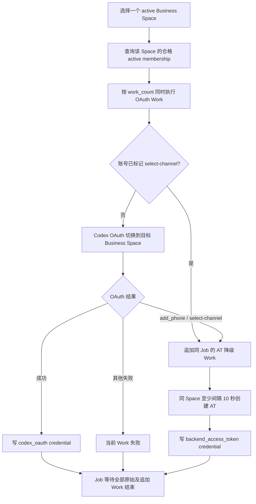

# Space 最新设计改动点与实施计划

更新时间：2026-07-23

本文是当前口径的执行计划，避免后续实现时继续按旧 Workspace / Codex OAuth 逻辑散改。

## 1. 最新设计口径

### 1.1 长期定时 Job 只保留 4 个

```text
1. automation.space_membership_invite_sync
2. automation.space_authorize
3. automation.space_downstream_push
4. automation.space_recycle_sweep
```

不再新增或保留以下长期定时 Job：

```text
proxy_maintenance
space_credential_heartbeat_usage
独立 space.usage_probe
邀请接受 job
远端成员回收/剔除 job
```

### 1.2 `/backend-api/wham/usage` 的唯一用途

```text
GET /backend-api/wham/usage
```

只允许用于：

```text
创建/导入 business space 时识别 spaces.credential_type。
```

不允许用于：

```text
automation.space_authorize
automation.space_downstream_push
automation.space_recycle_sweep
automation.space_membership_invite_sync
回收判断
授权阶段推断 credential_type
授权阶段改写 spaces.credential_type
```

回收用量来源只使用：

```text
POST /backend-api/codex/responses
读取 x-codex-* usage headers
```

### 1.3 credential_type 只跟 Space 走

```text
spaces.credential_type
```

允许值：

```text
personal_account
team_5h_weekly
team_monthly
```

`space_credentials` 不保存 `credential_type`。

### 1.4 凭证唯一性

当前凭证唯一性统一为：

```text
UNIQUE(space_id, user_account_id)
```

含义：

```text
同一个账号可以在多个 space 各有一条凭证。
同一个账号在同一个 space 只保留一条当前凭证。
```

## 2. Job 1：automation.space_membership_invite_sync

### 2.1 职责

```text
同步 business space 的远端 users / invites。
维护本地 space_memberships。
按规则发起新邀请。
```

### 2.2 上游接口

```text
GET  /backend-api/subscriptions?account_id={space.external_space_id}
GET  /backend-api/accounts/{space.external_space_id}/users?offset={offset}&limit={limit}&query=
GET  /backend-api/accounts/{space.external_space_id}/invites?offset={offset}&limit={limit}&query=
POST /backend-api/accounts/{space.external_space_id}/invites
```

以上接口属于空间管理员操作，必须使用该 `team_admin_sessions.id` 绑定的静态住宅 IP：

```text
proxy_inventory.proxy_type = static_proxy
team_admin_proxy_bindings.team_admin_session_id = team_admin_sessions.id
```

如果管理员 session 尚未绑定静态代理，流程必须先分配 `static_proxy`；没有可用静态代理时不能裸连调用上游接口。

### 2.3 远端同步规则

```text
远端 users 命中：
  upsert space_memberships
  membership_status = active
  清空 failure_code / failure_message

远端 invites 命中：
  仅当邮箱命中 account_status = active 的本地账号，且当前 space 下完全没有该账号的 membership 行时：
    insert space_memberships
    membership_status = active
  已有任意状态 membership 时不新增、不改状态
  账号不存在或 account_status != active 时不新增

本地 active / invited / accepted 但本轮远端 users 和 invites 都不存在：
  物理删除当前 space 下的 space_memberships 行
```

删除必须限定当前 space：

```sql
DELETE FROM space_memberships
WHERE space_id = :current_space_id
  AND user_account_id = :user_account_id;
```

禁止只按 `user_account_id` 删除，避免误删同一账号在其它 space 的 membership。

### 2.4 邀请数量规则

```text
space_limit = 1
space_id = 可选；指定时只处理该 active Business Space，留空自动选择
static_proxy_count = 50
invites_per_proxy = 20
invite_limit_per_space = 1000
work_count = 1000
target_count = 1000
```

明确：

```text
不按剩余席位减少邀请数量。
席位只做展示和诊断。
每轮最多处理 1 个 space。
候选不足 1000 时，本轮不创建邀请 Work。
该 space 固定启动 1000 个 invite work。
所有 invite work 直接使用本机网络，不选择或绑定代理。
1000 个 invite work 使用同一个内存 barrier，全部到齐后再同时发 POST invites。
```

### 2.5 选账号规则

必须满足：

```text
user_accounts.account_status = active
user_accounts.email 非空
同一个 space 下不存在 active / invited / accepted membership
同一个 space 下不存在 active credential
具备后续 space_authorize 可用的 Web 登录态：
  session_status = active
  cookie_header 或 session_token 至少一个非空
```

说明：

```text
failed membership 不算当前占位。
如果本地曾经写 failed，下一轮远端 users 已经能看到该账号，则更新为 active。
如果只有远端 invites 能看到该账号，已有 failed membership 保持不变；只有完全没有
membership 行且账号 account_status = active 时才新增 active membership。
```

明确不做：

```text
不排除已在其它 business space 的账号。
不查 cooldown。
不接受邀请。
不调用 invites/accept。
```

## 3. Job 2：automation.space_authorize

### 3.1 职责

```text
对指定 Business Space 下已经确认 active 的成员创建空间凭证。
优先创建 Codex OAuth credential。
只有 OAuth 命中 add_phone / select-channel 时，降级为 Web Access Token 创建 Business AT。
```

### 3.2 business/team 处理对象

必须满足：

```text
Job 参数 space_id 必填；一次 Job 只处理一个 Business Space
spaces.space_type = business
spaces.credential_type IN (team_5h_weekly, team_monthly)
spaces.space_status = active
space_memberships.membership_status = active
space_memberships.session_account_detected = true
当前 user_account_id + space_id 没有 active space_credentials
user_accounts.account_status = active
user_accounts.session_status = active
user_accounts.openai_user_id 非空
user_accounts.cookie_header / auth_cookie_header / session_token 至少一个非空
```

候选查询只读取本次 `space_id` 下的成员，不跨 Space 扫描。
运行中 Job 的去重也只按本次 `space_id` 判断：同一 Space 不重复启动；其它 Space
可以独立启动，不会错误返回另一个 Space 的授权 Job。

### 3.3 主路径：指定 Business Space 的 Codex OAuth

每个 OAuth Work：

```text
1. 使用当前成员账号绑定的账号代理。
2. 使用该账号已有 cookie/session 尝试 Codex OAuth。
3. OAuth 的 target_workspace_id 固定为 spaces.external_space_id。
4. 校验返回 token 的 chatgpt_account_id 等于 spaces.external_space_id。
5. 校验返回 token 的 user_id 等于 user_accounts.openai_user_id。
6. 成功后只 upsert 当前 user_account_id + space_id 的 space_credentials。
```

OAuth Work 不设置同空间互斥键，实际同时执行数只由 Job 的 `work_count` 控制。

OAuth 成功写入：

```text
space_credentials.auth_mode = codex_oauth
space_credentials.space_id = spaces.id
space_credentials.user_account_id = space_memberships.user_account_id
space_credentials.space_membership_id = space_memberships.id
space_credentials.access_token = OAuth access_token
space_credentials.id_token = OAuth id_token
space_credentials.refresh_token = OAuth refresh_token
space_credentials.codex_client_id = Codex client_id
space_credentials.account_id = user_accounts.openai_user_id
space_credentials.token_chatgpt_account_id = spaces.external_space_id
space_credentials.credential_status = active
```

### 3.4 降级路径：Web Access Token 创建 Business AT

只允许以下两种 OAuth 结果进入降级：

```text
add_phone_blocked
phone_otp_select_channel
```

账号已有 `user_accounts.codex_select_channel_required = true` 时，不再尝试 OAuth，直接进入降级。

除以上两种结果外，OAuth 的任何失败都直接使当前 OAuth Work 失败，不创建 AT Work。

降级不是在 OAuth Work 内直接请求，而是在同一个 Job 追加一个：

```text
space.business_access_token.create.account
```

同一个账号、同一个 Space、同一个 Job 最多追加一个降级 Work。该 Work 使用账号代理及成员账号的 Web 登录态：

```text
1. 通过 GET /api/auth/session?exchange_workspace_token=true&workspace_id={external_space_id}
   获取目标 Business Space 的 Web accessToken。
2. POST /backend-api/wham/auth-credentials。
3. 请求携带目标 workspace 的 Authorization 和 chatgpt-account-id。
```

创建接口 Body：

```json
{
  "name": "<credential_name>",
  "scopes": ["chatgpt.workspace.feature.allow-codex-local-access.access"],
  "ttl": 7776000
}
```

同一 Space 的降级 AT Work 使用同一个执行键串行领取；进程内再按
`spaces.external_space_id` 加锁，保证相邻 AT 请求开始时间至少间隔 10 秒。不同 Space 互不阻塞。

降级成功写入：

```text
space_credentials.auth_mode = backend_access_token
space_credentials.space_id = spaces.id
space_credentials.user_account_id = space_memberships.user_account_id
space_credentials.space_membership_id = space_memberships.id
space_credentials.access_token = response.access_token
space_credentials.external_credential_id = response.credential_id
space_credentials.expires_at = response.expires_at
space_credentials.refresh_token = ''
space_credentials.id_token = ''
space_credentials.codex_client_id = ''
space_credentials.token_chatgpt_account_id = spaces.external_space_id
space_credentials.credential_status = active
space_credentials.last_authorized_at = now
```

### 3.5 凭证级授权方式与下游 payload

授权方式记录在现有 `space_credentials.auth_mode`，不新增表：

```text
codex_oauth
backend_access_token
```

`spaces.credential_type` 仍然只负责余额、推送量和回收规则；不会因授权结果改变。

下游 payload 按凭证授权方式选择：

```text
space_credentials.auth_mode = codex_oauth
  -> 使用现有 DownstreamCodexPayload
  -> 调下游 push_codex_credential

space_credentials.auth_mode = backend_access_token
  -> 使用现有 Business AT payload
  -> 调下游 push_business_access_token
```

两种 payload 的余额和坑位仍按 `spaces.credential_type` 记账。

### 3.6 授权 Job 禁止事项

```text
不调用 GET /backend-api/wham/usage
不创建 membership
不修改 membership_status
不把 invited / unknown / failed 改 active
不 upsert business space
不修改 spaces.credential_type
不邀请账号
不接受邀请
不推送下游
不回收
```

### 3.7 完整流程



代码必须保持：

```text
读取已有 spaces
读取已有 active space_memberships
OAuth 优先，且 target_workspace_id 来自 spaces.external_space_id
仅两类 phone gate 追加 AT Work
只写 space_credentials
不调用 fetch_wham_usage()
不调用 infer_credential_type()
不 upsert business spaces
不写 membership_status
```

## 4. Job 3：automation.space_downstream_push

### 4.1 职责

```text
按下游 channel + credential_type 的余额和坑位补量推送。
```

入口必须从：

```text
downstream_channel_credential_type_balances
```

不能从 `space_credentials` 全表盲扫。

### 4.2 支持下游

```text
sub2api
cpa
local_sub2api
custom_http
```

接口/行为：

```text
sub2api:
  POST /api/v1/admin/accounts/import/codex-session

cpa:
  POST /v0/management/auth-files

custom_http:
  POST downstream_channels.base_url
  Header 使用 custom_auth_header_name/custom_auth_header_value
  Codex OAuth payload 按 custom_payload_type 构造:
    sub2api / sub2api_admin_accounts / cpa
  backend_access_token 直接发送 Business AT payload

local_sub2api:
  不发 HTTP
  生成本地 sub2api JSON 导入文件
  downstream_external_id 写生成文件路径
```

### 4.3 推送选择规则

推送数量和同时 Work 数是两个独立概念：

```text
业务缺口决定取多少凭证。
work_count 只决定同时跑几个推送 work。
work_count 不参与推送数量计算。
```

对每个：

```text
downstream_channel_id + credential_type
```

判断：

```text
channel.enabled = true
balance_status = active
max_active_slots > 0
```

active slot：

```text
push_status IN ('pushing', 'pushed', 'failed')
```

允许占用坑位：

```text
max_slots = downstream_channel_credential_type_balances.max_active_slots
base_slots = max(1, max_slots // 2)
high_usage_count = 当前 downstream_channel_id + credential_type 下
  push_status IN ('pushing', 'pushed', 'failed')
  且任一 usage_percent >= 70 的凭证数量
allowed_active_slots = min(max_slots, base_slots + high_usage_count)
```

含义：

```text
默认先推 max_active_slots 的一半，至少 1 个。
已有坑位里每多 1 个额度使用 >= 70% 的凭证，才放开下 1 个坑位。
最多不超过 max_active_slots。
```

新推送要求：

```text
push_balance > 0
active_slot_count < allowed_active_slots
```

retry failed 不消耗新的 `push_balance`。

选取数量：

```text
retryable_failed_count = min(remaining_slots, retryable_failed_available_count)
new_push_count = min(remaining_slots - retryable_failed_count, push_balance, new_available_count)
selected_count = retryable_failed_count + new_push_count
```

禁止：

```text
不能用 schedule limit / work 数限制 selected_count。
不能因为 work_count=5 就只取 5 个凭证。
```

### 4.4 推送状态变化

新推送占位：

```text
downstream_channel_credential_type_balances.push_balance -= 1
downstream_channel_credential_type_balances.claimed_push_count += 1
space_push_bindings.push_status = pushing
```

成功：

```text
space_push_bindings.push_status = pushed
space_push_bindings.pushed_count += 1
downstream_channel_credential_type_balances.pushed_count += 1
```

失败：

```text
space_push_bindings.push_status = failed
space_push_bindings.failed_push_count += 1
downstream_channel_credential_type_balances.failed_push_count += 1
```

本地校验跳过且未实际发出请求：

```text
downstream_channel_credential_type_balances.push_balance += 1
downstream_channel_credential_type_balances.claimed_push_count -= 1
space_push_bindings.push_status = skipped
```

每次实际请求必须写：

```text
space_push_attempts
```

## 5. Job 4：automation.space_recycle_sweep

### 5.1 职责

```text
扫描已经 pushed 的凭证。
用 Codex Responses probe 读取 usage。
正常达到 95% 回收阈值时，进入结算并标记 used。
异常最终不可用时，也进入结算。
结算规则统一为：usage_percent >= 60 标记 used；usage_percent < 60 标记 skipped 并退回 push_balance。
```

### 5.2 上游接口

```text
POST /backend-api/codex/responses
Authorization: Bearer <space_credentials.access_token>
```

business/team 必须带：

```text
chatgpt-account-id: spaces.external_space_id
```

不调用：

```text
GET /backend-api/wham/usage
```

### 5.3 回收与结算判断

只处理：

```text
space_push_bindings.push_status = pushed
```

坑位统计不包含 used / skipped：

```text
占坑位: pushing / pushed / failed
不占坑位: used / skipped
```

按凭证类型：

```text
personal_account:
  按配置规则判断，达到 95% 阈值后进入结算。

team_5h_weekly:
  five_hour 只记录，不触发回收。
  weekly >= 95% 时进入结算。

team_monthly:
  monthly >= 95% 时进入结算。
```

结算规则：

```text
正常达到 95%:
  usage_percent >= 60 必然成立
  space_push_bindings.push_status = used
  释放坑位
  不退 push_balance

异常最终不可用:
  取本次 probe header 或最后一次记录的 usage_percent
  usage_percent >= 60:
    push_status = used
    释放坑位
    不退 push_balance
  usage_percent < 60:
    push_status = skipped
    space_credentials.credential_status = invalid
    释放坑位
    downstream_channel_credential_type_balances.push_balance += 1
    downstream_channel_credential_type_balances.claimed_push_count -= 1
```

非最终错误：

```text
网络错误 / 5xx / usage header 缺失 / 未识别错误:
  只写 check_failed
  recycle_status = failed
  push_status 保持 pushed
  继续占坑位，等待下轮重试
```

当前按 HTTP 401 / 402 作为最终不可用信号。

### 5.4 used / skipped 动作

used 只改本地：

```text
space_push_bindings.push_status = used
space_push_bindings.used_count += 1
space_push_bindings.recycled_at = now
space_credential_usage_states.usage_status = used
downstream_channel_credential_type_balances.used_count += 1
```

skipped 只改本地并退回推送余额：

```text
space_push_bindings.push_status = skipped
space_push_bindings.recycled_at = now
space_credentials.credential_status = invalid
downstream_channel_credential_type_balances.push_balance += 1
downstream_channel_credential_type_balances.claimed_push_count -= 1
```

明确不做：

```text
不剔除远端成员
不删除 space_memberships
不创建 remote_member_release_tasks
不调用远端删除成员接口
不写账号 cooldown
```

## 6. 实施顺序

### Phase 1：清理授权 workflow

目标：

```text
让 automation.space_authorize 符合最新设计。
```

改动：

```text
1. 删除 business 授权流程中的 fetch_wham_usage。
2. 删除 business 授权流程中的 infer_credential_type。
3. 删除 business 授权流程中的 business space upsert。
4. 删除 _upsert_business_membership。
5. Job 参数必须指定一个 active Business Space，候选只从该 Space 读取。
6. business 授权优先执行目标 Space 的 Codex OAuth。
7. 只有 add_phone / select-channel 才追加 Web Access Token 降级 Work。
8. 同 Space 的降级 AT 请求至少间隔 10 秒，不同 Space 互不阻塞。
9. membership 不存在、不是 active 或未识别目标 Space 时失败/跳过。
10. 授权成功只写 space_credentials，并按结果写 auth_mode。
```

验证：

```text
授权 job 不再改 space_memberships。
授权 job 不再改 spaces.credential_type。
授权 job 不再调用 /wham/usage。
OAuth 成功写 auth_mode=codex_oauth。
phone gate 降级成功写 auth_mode=backend_access_token。
非 phone gate 的 OAuth 失败不会创建 Business AT。
```

### Phase 2：实现/修正空间成员同步与邀请

目标：

```text
让 automation.space_membership_invite_sync 成为 membership active/invited 的唯一写入入口。
```

改动：

```text
1. 同步 subscriptions/users/invites。
2. users 命中写 active。
3. invites 命中 active 账号且本地完全没有 membership 时新增 active；已有 membership 不修改。
4. 本地 active/invited/accepted 但远端 users/invites 都不存在时，按当前 space_id 物理删除 membership。
5. 空间邀请固定实现 1000 条直连 Work，并使用一个内存屏障。
6. 去掉 cooldown / other-space 排除。
7. 不调用 invites/accept。
```

验证：

```text
同一账号在多个 space 时，只删除当前 space 的 membership。
达到 1000 后不再邀请。
席位不足不影响邀请数量。
```

### Phase 3：修正推送主流程

目标：

```text
从 downstream_channel_credential_type_balances 出发补量。
```

改动：

```text
1. 按 channel + credential_type 计算 active slot。
   allowed_active_slots = min(max_active_slots, max(1, max_active_slots // 2) + high_usage_count)。
   high_usage_count = 已推/推送中/失败且 usage_percent >= 70 的凭证数量。
2. remaining_slots = allowed_active_slots - active_slot_count。
3. 先 retry failed，数量不超过 remaining_slots。
4. 剩余缺口再按 push_balance 选择新 credential。
5. work_count 只控制这些 work 同时跑几个，不限制一共取几个 credential。
6. payload 按 spaces.credential_type 分支。
7. 支持 sub2api / cpa / local_sub2api / custom_http。
8. 每次实际请求写 space_push_attempts。
```

验证：

```text
used 不再推。
pushed/pushing 不重复推。
retry 不扣新 push_balance。
新推送扣 push_balance。
custom_http 和 local_sub2api 可走通。
```

### Phase 4：修正回收主流程

目标：

```text
只扫 pushed，使用 Codex Responses probe 更新 usage，并按 used/skipped 结算释放坑位。
```

改动：

```text
1. 扫 space_push_bindings.push_status = pushed。
2. 调 /backend-api/codex/responses。
3. 解析 x-codex usage headers。
4. 写 space_usage_checks。
5. 更新 space_credential_usage_states。
6. 按 credential_type 规则判断 95% 阈值。
7. 达到 95% 后进入结算：>=60 used；<60 skipped 并退 balance。
8. 异常最终不可用也进入同一套结算。
9. 非最终错误只标记 check_failed，等待重试。
10. 不调用 /wham/usage。
11. 不剔除远端成员。
```

验证：

```text
team_5h_weekly five_hour 满不回收。
team_5h_weekly weekly >= 95% 结算为 used 并释放坑位。
team_monthly monthly >= 95% 结算为 used 并释放坑位。
异常最终不可用且 usage_percent < 60 结算为 skipped、释放坑位、退 push_balance。
非最终错误保持 pushed，占坑位，等待下轮重试。
```

### Phase 5：清理长期调度和入口

目标：

```text
长期定时任务只剩 4 个 Space job。
```

改动：

```text
1. 移除旧 workspace/codex credential/batch/release 定时入口。
2. 不新增 proxy_maintenance。
3. 不新增独立 usage_probe。
4. API/UI 只展示 Space 口径 job。
```

验证：

```text
调度列表只有:
  automation.space_membership_invite_sync
  automation.space_authorize
  automation.space_downstream_push
  automation.space_recycle_sweep
```

## 7. 当前已知待修代码点

```text
无允许猜测的隐藏待修项。

当前实现必须通过以下证据核验：
  - space_authorization.py 不出现 fetch_wham_usage / infer_credential_type / _upsert_business_membership。
  - automation.space_authorize 只从指定 Business Space 的 active membership 选成员。
  - OAuth target_workspace_id 等于 spaces.external_space_id。
  - 只有 add_phone / select-channel 会追加 Web Access Token 降级 Work。
  - space_credentials.auth_mode 决定下游使用 Codex OAuth 或 Business AT payload。
  - automation.space_recycle_sweep 不调用 /backend-api/wham/usage。
  - 迁移约束 automation_schedules.schedule_type 包含 4 个 Space job。
```
