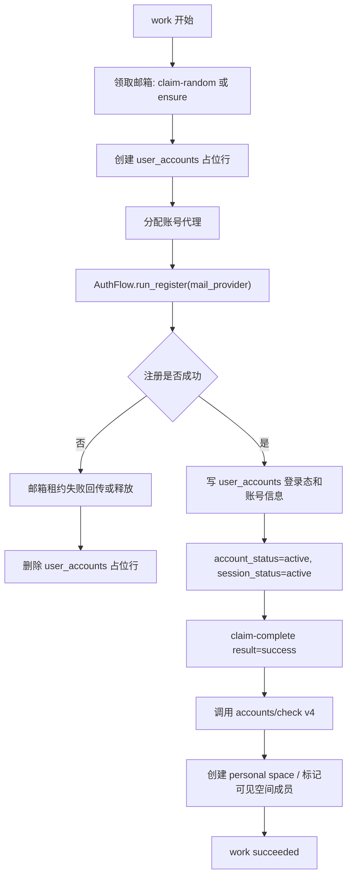
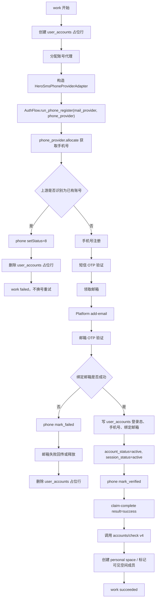

# 19. 账号注册接入设计

更新时间：2026-07-11

本文固化邮箱浏览器注册与纯协议注册接入平台的设计。目标是把注册能力接入 `refactor-app` 的账号、代理、邮箱池、Job/Work 体系，不再靠临时口头约定。

浏览器邮箱注册复用同一套账号、代理、邮箱、Job/Work 和注册后 v4 探测流程，仅替换 OpenAI 注册执行器。

## 0. 范围

实现三种模式：

```text
1. phone_protocol_bind_email
   手机号纯协议注册，注册完成后绑定邮箱。

2. email_protocol_no_phone
   邮箱纯协议注册，注册完成即结束，不绑定手机号。

3. email_browser_no_phone
   邮箱通过 Camoufox 浏览器注册，不绑定手机号。
```

`email_browser_no_phone` 的 Work 流程：

```text
创建 registering 账号
→ 分配账号代理
→ 领取邮箱
→ Camoufox 完成邮箱、密码、OTP、姓名和生日页面
→ GET /api/auth/session 获取 Web 登录态
→ 写 user_accounts
→ 使用同一账号代理调用 accounts/check v4
→ 创建个人空间并标记可见空间成员
→ 邮箱 complete
```

浏览器模式不调用手机号接口，不执行 Codex OAuth。

明确不做：

```text
邮箱注册模式不判断“是否要求手机号”。
邮箱注册模式不切换手机号兜底。
邮箱注册模式不绑定手机号。
注册成功时不做 Codex 授权。
注册成功时不推送下游。
```

如果邮箱注册过程中被上游阻断、要求手机号或状态不可继续：

```text
该 work 失败。
记录错误。
回传或释放邮箱租约。
不进入手机号流程。
```

## 1. 证据

### 1.1 外部邮箱池 API

接口文档：

```text
/Users/chaopenglv/data/me/outlookEmailPlus/注册与邮箱池接口文档.md
```

证据：

```text
X-API-Key 鉴权:
  /Users/chaopenglv/data/me/outlookEmailPlus/注册与邮箱池接口文档.md:29

验证码:
  /Users/chaopenglv/data/me/outlookEmailPlus/注册与邮箱池接口文档.md:99
  /Users/chaopenglv/data/me/outlookEmailPlus/注册与邮箱池接口文档.md:387

邮箱池领取 / 释放 / 完成:
  /Users/chaopenglv/data/me/outlookEmailPlus/注册与邮箱池接口文档.md:108
  /Users/chaopenglv/data/me/outlookEmailPlus/注册与邮箱池接口文档.md:109
  /Users/chaopenglv/data/me/outlookEmailPlus/注册与邮箱池接口文档.md:110
  /Users/chaopenglv/data/me/outlookEmailPlus/注册与邮箱池接口文档.md:445
  /Users/chaopenglv/data/me/outlookEmailPlus/注册与邮箱池接口文档.md:521
  /Users/chaopenglv/data/me/outlookEmailPlus/注册与邮箱池接口文档.md:533
```

邮箱池回传必须持久化这些字段：

```text
account_id
claim_token
caller_id
task_id
```

证据：

```text
/Users/chaopenglv/data/me/outlookEmailPlus/注册与邮箱池接口文档.md:527
/Users/chaopenglv/data/me/outlookEmailPlus/注册与邮箱池接口文档.md:528
/Users/chaopenglv/data/me/outlookEmailPlus/注册与邮箱池接口文档.md:529
/Users/chaopenglv/data/me/outlookEmailPlus/注册与邮箱池接口文档.md:530
/Users/chaopenglv/data/me/outlookEmailPlus/注册与邮箱池接口文档.md:539
/Users/chaopenglv/data/me/outlookEmailPlus/注册与邮箱池接口文档.md:540
/Users/chaopenglv/data/me/outlookEmailPlus/注册与邮箱池接口文档.md:541
/Users/chaopenglv/data/me/outlookEmailPlus/注册与邮箱池接口文档.md:542
/Users/chaopenglv/data/me/outlookEmailPlus/注册与邮箱池接口文档.md:651
/Users/chaopenglv/data/me/outlookEmailPlus/注册与邮箱池接口文档.md:652
/Users/chaopenglv/data/me/outlookEmailPlus/注册与邮箱池接口文档.md:653
/Users/chaopenglv/data/me/outlookEmailPlus/注册与邮箱池接口文档.md:654
```

### 1.2 当前平台已有账号表

`user_accounts` 已存在，包含邮箱、手机号、密码、session、access token、cookie、状态字段。

证据：

```text
/Users/chaopenglv/data/me/Gpt-Agreement-Payment/refactor-app/src/refactor_app/infrastructure/db/models.py:15
```

结论：

```text
注册成功账号直接写 user_accounts。
不新增第二张账号表。
```

### 1.3 当前平台已有邮箱租约表，但注册流程不使用它作为主状态

当前表：

```text
external_mail_leases
```

证据：

```text
/Users/chaopenglv/data/me/Gpt-Agreement-Payment/refactor-app/src/refactor_app/infrastructure/db/models.py:603
```

结论：

```text
注册流程不新增邮箱表。
注册流程不扩展 external_mail_leases。
claim-random 返回字段保存在当前 work 的 output_json。
```

### 1.4 老项目 Hero SMS 手机号纯协议配置

手机号模式参考老项目 `hero_sms` 配置，不设计成未知 provider。

证据：

```text
老项目 phone_protocol 分支：
  /Users/chaopenglv/data/me/Gpt-Agreement-Payment/pipeline.py:726
  /Users/chaopenglv/data/me/Gpt-Agreement-Payment/pipeline.py:742
  /Users/chaopenglv/data/me/Gpt-Agreement-Payment/pipeline.py:743
  /Users/chaopenglv/data/me/Gpt-Agreement-Payment/pipeline.py:745

Hero SMS 默认配置：
  /Users/chaopenglv/data/me/Gpt-Agreement-Payment/webui/backend/runner.py:278
  /Users/chaopenglv/data/me/Gpt-Agreement-Payment/webui/backend/runner.py:279
  /Users/chaopenglv/data/me/Gpt-Agreement-Payment/webui/backend/runner.py:280
  /Users/chaopenglv/data/me/Gpt-Agreement-Payment/webui/backend/runner.py:281
  /Users/chaopenglv/data/me/Gpt-Agreement-Payment/webui/backend/runner.py:282

Hero SMS 配置校验和提示：
  /Users/chaopenglv/data/me/Gpt-Agreement-Payment/webui/backend/config_health.py:299
  /Users/chaopenglv/data/me/Gpt-Agreement-Payment/webui/backend/config_health.py:302
  /Users/chaopenglv/data/me/Gpt-Agreement-Payment/webui/backend/config_health.py:315
  /Users/chaopenglv/data/me/Gpt-Agreement-Payment/webui/backend/config_health.py:326

Hero SMS PhoneProvider 实现：
  /Users/chaopenglv/data/me/Gpt-Agreement-Payment/CTF-reg/phone_provider.py:123
  /Users/chaopenglv/data/me/Gpt-Agreement-Payment/CTF-reg/phone_provider.py:133
  /Users/chaopenglv/data/me/Gpt-Agreement-Payment/CTF-reg/phone_provider.py:383
  /Users/chaopenglv/data/me/Gpt-Agreement-Payment/CTF-reg/phone_provider.py:397
  /Users/chaopenglv/data/me/Gpt-Agreement-Payment/CTF-reg/phone_provider.py:505
  /Users/chaopenglv/data/me/Gpt-Agreement-Payment/CTF-reg/phone_provider.py:583
  /Users/chaopenglv/data/me/Gpt-Agreement-Payment/CTF-reg/phone_provider.py:633
  /Users/chaopenglv/data/me/Gpt-Agreement-Payment/CTF-reg/phone_provider.py:742
  /Users/chaopenglv/data/me/Gpt-Agreement-Payment/CTF-reg/phone_provider.py:749

AuthFlow 调用口径：
  /Users/chaopenglv/data/me/Gpt-Agreement-Payment/refactor-app/src/refactor_app/plugins/openai_auth_protocol/auth_flow.py:3106
  /Users/chaopenglv/data/me/Gpt-Agreement-Payment/refactor-app/src/refactor_app/plugins/openai_auth_protocol/auth_flow.py:3125
  /Users/chaopenglv/data/me/Gpt-Agreement-Payment/refactor-app/src/refactor_app/plugins/openai_auth_protocol/auth_flow.py:3215
  /Users/chaopenglv/data/me/Gpt-Agreement-Payment/refactor-app/src/refactor_app/plugins/openai_auth_protocol/auth_flow.py:3277
  /Users/chaopenglv/data/me/Gpt-Agreement-Payment/refactor-app/src/refactor_app/plugins/openai_auth_protocol/auth_flow.py:3294
```

结论：

```text
新增实现 HeroSmsPhoneProviderAdapter。
不从 refactor-app 运行时 import 老项目 CTF-reg/phone_provider.py。
老项目只作为实现依据。
```

### 1.5 当前平台已有 Work 体系

证据：

```text
/Users/chaopenglv/data/me/Gpt-Agreement-Payment/refactor-app/src/refactor_app/infrastructure/db/models.py:687
```

结论：

```text
注册任务按 job + work_items 运行。
work_count 表示同时运行多少个 work。
不再额外设计“并发”概念。
```

### 1.6 当前已有 OpenAI 纯协议底层入口

手机号纯协议注册：

```text
AuthFlow.run_phone_register(mail_provider, phone_provider)
```

邮箱纯协议注册：

```text
AuthFlow.run_register(mail_provider)
```

证据：

```text
/Users/chaopenglv/data/me/Gpt-Agreement-Payment/refactor-app/src/refactor_app/plugins/openai_auth_protocol/auth_flow.py:3106
/Users/chaopenglv/data/me/Gpt-Agreement-Payment/refactor-app/src/refactor_app/plugins/openai_auth_protocol/auth_flow.py:3299
```

手机号注册后绑定邮箱底层动作：

```text
_bind_email_protocol_via_platform(...)
```

证据：

```text
/Users/chaopenglv/data/me/Gpt-Agreement-Payment/refactor-app/src/refactor_app/plugins/openai_auth_protocol/auth_flow.py:1459
```

### 1.6 外部项目只能作为证据，不能作为运行时依赖

证据：

```text
/Users/chaopenglv/data/me/Gpt-Agreement-Payment/refactor-app/AGENTS.md:7
/Users/chaopenglv/data/me/Gpt-Agreement-Payment/refactor-app/AGENTS.md:9
/Users/chaopenglv/data/me/Gpt-Agreement-Payment/refactor-app/AGENTS.md:11
```

## 2. Job / Work 设计

新增 Job：

```text
account.protocol_register
```

职责：

```text
按输入 count 创建注册 work。
```

新增 Work：

```text
account.protocol_register.one
```

职责：

```text
一个 work 注册一个账号。
```

`work_count` 语义：

```text
work_count = 同时运行的 work 数。

count = 100
work_count = 5

表示最多 5 个 work 同时跑。
某个 work 结束后，如果还有 queued work，再启动下一个。
直到 100 个 work 全部结束。
```

Job 输入：

```json
{
  "mode": "email_protocol_no_phone",
  "count": 100,
  "work_count": 5,
  "mail_provider": "outlook",
  "email_domain": "",
  "project_key": "openai-register"
}
```

手机号模式：

```json
{
  "mode": "phone_protocol_bind_email",
  "count": 100,
  "work_count": 5,
  "mail_provider": "outlook",
  "email_domain": "",
  "project_key": "openai-register",
  "phone_provider": "hero_sms",
  "phone_base_url": "https://hero-sms.com/stubs/handler_api.php",
  "phone_api_key_env": "HERO_SMS_API_KEY",
  "phone_service": "dr",
  "phone_country": "",
  "phone_countries": ["151", "73", "16"],
  "phone_max_price": "0.05",
  "phone_country_max_prices": {},
  "phone_max_number_attempts": 3,
  "phone_otp_timeout_s": 180,
  "phone_otp_poll_interval_s": 3
}
```

## 3. 模式 1：邮箱纯协议注册，不绑手机号



规则：

```text
只走 AuthFlow.run_register(mail_provider)。
不调用 phone_provider。
不判断是否要求手机号。
不绑定手机号。
调用 accounts/check v4，创建 personal space，并标记本地已存在的可见空间成员。
不创建凭证。
不推送下游。
```

成功写 `user_accounts`：

```text
email = 注册邮箱
password = 注册流程使用的密码
access_token = 注册后获取到的 ChatGPT access_token
session_token = 注册后获取到的 session_token
cookie_header = 注册后获取到的 chatgpt cookie
auth_cookie_header = 注册后获取到的 auth/openai cookie
device_id = 注册后获取到的 device id
csrf_token = 注册后获取到的 csrf token
account_status = active
session_status = active
last_session_refresh_at = now
```

失败处理：

```text
不保留 user_accounts 失败账号。
删除本次 work 创建的 user_accounts 占位行。
错误记录保存在 work_items / job_runs / 结构化日志中。
```

## 4. 模式 2：手机号纯协议注册，绑定邮箱



规则：

```text
只走 AuthFlow.run_phone_register(mail_provider, phone_provider)。
注册账号最终必须绑定邮箱。
user_accounts.email 写绑定邮箱。
user_accounts.phone_number / phone_dial_code / phone_country 写手机号信息。
绑定邮箱失败，整个 work 失败。
绑定邮箱等待验证码 120 秒超时后，释放当前邮箱并领取新邮箱重试。
单个账号最多尝试绑定 10 个邮箱；连续 10 个邮箱都超时后 work 失败。
发验证码、验证码校验等明确错误不换邮箱，直接失败。
手机号进入 login_password、email_otp_verification 或 /log-in 分支时，判定为已有账号。
已有账号直接 mark_failed 并结束当前 work，不重新领取手机号。
调用 accounts/check v4，创建 personal space，并标记本地已存在的可见空间成员。
不创建凭证。
不推送下游。
```

## 5. 数据模型改动

### 5.1 user_accounts

扩展 `account_status`：

```text
当前:
active
invalid

新增:
registering
```

原因：

```text
注册 work 需要先创建账号行，用来绑定代理。
注册完成前，该账号不能进入空间授权、推送、回收等其他流程。
注册失败后不保留失败账号，直接删除本次 work 创建的占位账号行。
```

约束：

```text
现有流程选择可用账号时，必须继续显式要求 account_status = active。
```

### 5.2 不新增或扩展外部邮箱表

注册流程直接调用外部邮箱 API。

```text
不新增邮箱表。
不扩展 external_mail_leases。
不把 external_mail_leases 作为注册流程的主状态表。
```

claim-random 返回的必要参数只属于当前注册 work：

```text
account_id
claim_token
caller_id
task_id
email
provider
project_key
```

保存位置：

```text
work_items.output_json.registration_mail_claim
```

用途：

```text
1. 当前 work 后续调用 claim-complete / claim-release。
2. 页面展示当前 work 使用过哪个邮箱。
3. work 异常时能从 work 输出中看到 claim 上下文。
```

说明：

```text
这不是新增业务表。
这是 work 运行状态。
```

## 6. Provider / Adapter 设计

### 6.1 ExternalMailApiClient 扩展

补齐：

```text
claim_random(caller_id, task_id, provider, project_key, email_domain)
claim_release(account_id, claim_token, caller_id, task_id, reason)
claim_complete(account_id, claim_token, caller_id, task_id, result, detail)
```

邮箱 provider 规则按邮箱池接口文档执行：

```text
默认 mail_provider = outlook。

outlook.com / hotmail.com / live.com / live.cn
统一传 provider = outlook。

只有需要 CF 临时邮箱池时，才传 provider = cloudflare_temp_mail。

需要 iCloud Hide My Email 邮箱池时，传 provider = icloud_hide_my_email。
注册和验证码查询始终使用 claim-random 返回的 iCloud 地址；
Outlook 转发邮箱由邮箱服务内部解析，注册平台不保存、不传递。
iCloud 模式不传 email_domain。

账号注册流程只获取 ChatGPT Web 登录态：
完成 ChatGPT callback 后调用 /api/auth/session，保存 session_token 和 access_token。
注册流程不执行 Codex OAuth、不调用 /oauth/token 换取 Codex refresh_token；
Codex 授权由注册完成后的独立授权流程处理。

当前外部邮箱池接口只支持按 provider 筛选；
不支持按邮箱域名、分组、标签进一步筛选。
所以 email_domain 只作为预留配置，不能依赖它选择 outlook/hotmail/live。

注册 job 启动 work 前必须先预检:
GET /api/external/pool/stats

如果返回 FEATURE_DISABLED / FORBIDDEN / IP_NOT_ALLOWED 等错误，
job 直接失败，不创建批量注册 work。
这样页面看到的是外部邮箱池配置错误，
不是 10 个/100 个注册 work 全部失败。
```

保留现有：

```text
ensure_email
wait_for_otp_by_email
```

### 6.2 RegistrationMailProviderAdapter

新增注册专用邮箱适配器，满足 `AuthFlow` 的调用口径：

```text
create_mailbox()
wait_for_otp(email, timeout, issued_after, max_polls)
mark_used(email)
mark_unused(email)
```

映射：

```text
create_mailbox:
  直接调用外部 API claim-random 或 ensure。
  claim-random 返回值写入当前 work 的 output_json.registration_mail_claim。

wait_for_otp:
  GET /api/external/verification-code。

mark_used:
  claim-complete(result=success)。

mark_unused:
  claim-release 或 claim-complete(result=network_error / verification_timeout 等)。
```

### 6.3 HeroSmsPhoneProviderAdapter

手机号模式只接 Hero SMS 纯协议配置，provider 支持：

```text
allocate()
poll_otp(lease_id)
mark_verified(lease_id)
mark_failed(lease_id, reason)
```

配置字段：

```text
provider = hero_sms
base_url = https://hero-sms.com/stubs/handler_api.php
api_key 或 api_key_env = HERO_SMS_API_KEY
service = dr
country = ""                           countries 为空时才使用
countries = [151, 73, 16]              优先；默认随机排序后轮询
maxPrice / max_price = "0.05"          默认统一最高价
country_max_prices = {}                可选，按国家最高价
max_number_attempts = 3
request_timeout_s = 20
otp_timeout_s = 180
otp_poll_interval_s = 3
```

Hero SMS 上游动作：

```text
allocate:
  GET handler_api.php?action=getNumberV2&service={service}&country={country}&maxPrice={maxPrice}

poll_otp:
  GET handler_api.php?action=getStatusV2&id={activationId}

mark_verified:
  GET handler_api.php?action=setStatus&id={activationId}&status=6

mark_failed:
  GET handler_api.php?action=setStatus&id={activationId}&status=8
```

返回字段映射：

```text
activationId -> lease_id
phoneNumber -> phone_e164 / phone_national
countryPhoneCode -> phone_dial_code
country -> phone_country/provider_country
activationEndTime -> expires_at
```

运行规则：

```text
phoneNumber 必须是完整号码；脱敏号码直接失败。
countryPhoneCode 存在时，移除本地号码前导 0 后再拼 E.164。
getStatusV2 同时解析 sms 和 call 验证码。
getNumberV2 / getStatusV2 的临时 HTTP、连接和限流错误按老实现重试。
BAD_KEY / NO_BALANCE 等确定错误不重试。
OTP 超时取消号码时，如 Hero 返回 EARLY_CANCEL_DENIED，按配置延迟重试 setStatus=8。
手机号被识别为已有 OpenAI 账号时直接失败，不换号。
HERO_SMS_API_KEY 由 Settings 注入 Work，禁止写入 jobs.input_json。
```

证据：

```text
/Users/chaopenglv/data/me/Gpt-Agreement-Payment/CTF-reg/config.py:94
/Users/chaopenglv/data/me/Gpt-Agreement-Payment/CTF-reg/config.py:99
/Users/chaopenglv/data/me/Gpt-Agreement-Payment/CTF-reg/config.py:100
/Users/chaopenglv/data/me/Gpt-Agreement-Payment/CTF-reg/phone_provider.py:123
/Users/chaopenglv/data/me/Gpt-Agreement-Payment/CTF-reg/phone_provider.py:133
/Users/chaopenglv/data/me/Gpt-Agreement-Payment/CTF-reg/phone_provider.py:383
/Users/chaopenglv/data/me/Gpt-Agreement-Payment/CTF-reg/phone_provider.py:397
/Users/chaopenglv/data/me/Gpt-Agreement-Payment/CTF-reg/phone_provider.py:505
/Users/chaopenglv/data/me/Gpt-Agreement-Payment/CTF-reg/phone_provider.py:536
/Users/chaopenglv/data/me/Gpt-Agreement-Payment/CTF-reg/phone_provider.py:540
/Users/chaopenglv/data/me/Gpt-Agreement-Payment/CTF-reg/phone_provider.py:541
/Users/chaopenglv/data/me/Gpt-Agreement-Payment/CTF-reg/phone_provider.py:558
/Users/chaopenglv/data/me/Gpt-Agreement-Payment/CTF-reg/phone_provider.py:583
/Users/chaopenglv/data/me/Gpt-Agreement-Payment/CTF-reg/phone_provider.py:633
/Users/chaopenglv/data/me/Gpt-Agreement-Payment/CTF-reg/phone_provider.py:742
/Users/chaopenglv/data/me/Gpt-Agreement-Payment/CTF-reg/phone_provider.py:749
/Users/chaopenglv/data/me/Gpt-Agreement-Payment/refactor-app/src/refactor_app/plugins/openai_auth_protocol/auth_flow.py:3125
/Users/chaopenglv/data/me/Gpt-Agreement-Payment/refactor-app/src/refactor_app/plugins/openai_auth_protocol/auth_flow.py:3215
/Users/chaopenglv/data/me/Gpt-Agreement-Payment/refactor-app/src/refactor_app/plugins/openai_auth_protocol/auth_flow.py:3277
/Users/chaopenglv/data/me/Gpt-Agreement-Payment/refactor-app/src/refactor_app/plugins/openai_auth_protocol/auth_flow.py:3294
```

实现边界：

```text
refactor-app 内重新实现 HeroSmsPhoneProviderAdapter。
不运行时 import CTF-reg/phone_provider.py。
不新增 phone lease 业务表。
activationId、phoneNumber、countryPhoneCode 等只保存在当前 work output_json 和成功后的 user_accounts 字段。
```

## 7. 代理规则

注册调用 OpenAI / ChatGPT / Auth 上游接口时，必须走账号代理。

流程：

```text
1. work 开始后先确定目标邮箱，再创建 user_accounts 占位行，account_status=registering。
2. 规范化目标邮箱后计算 SHA-256，稳定映射到一个 Webshare Backbone endpoint。
3. endpoint 用户名带国家代码，默认 US，可通过
   REFACTOR_APP_PROTOCOL_REGISTER_PROXY_COUNTRY 配置。
4. AuthFlow、注册后的 accounts/check v4 以及 iCloud 密码/2FA 使用同一条注册代理。
5. 注册成功后账号转 active。
6. 注册失败后删除 user_accounts 占位行，不保留 invalid 账号。
```

说明：

```text
注册生命周期和个人空间绑定支付方式使用静态 Backbone 代理。
两者都按目标邮箱哈希复用同一 endpoint 和国家配置，且不写入 user_account_proxy_bindings；
其他登录、补 Session、授权仍使用各自既有代理逻辑。
不把全局 protocol_register_proxy_url 作为默认代理覆盖账号绑定。
不使用 team admin 静态住宅代理。
team admin 静态住宅代理只属于空间管理员操作。
```

## 8. 邮箱池回传规则

成功：

```text
claim-complete(result=success)
```

未使用邮箱即中止：

```text
claim-release(reason=...)
```

已使用邮箱但注册失败，按外部邮箱池已有 result 枚举回传：

```text
verification_timeout
provider_blocked
credential_invalid
network_error
```

证据：

```text
/Users/chaopenglv/data/me/outlookEmailPlus/注册与邮箱池接口文档.md:543
```

初始映射：

```text
验证码超时:
  verification_timeout

外部邮箱 API 读信失败 / 邮箱凭据失效:
  credential_invalid

外部邮箱 provider 风控或被封:
  provider_blocked

代理错误、OpenAI 临时网络错误、HTTP 5xx:
  network_error
```

不设计邮箱已占用分支：

```text
外部邮箱池提供的是新邮箱。
OpenAI 不会返回邮箱已被注册。
因此注册流程不为“邮箱已被占用”单独设计 release / complete 分支。
```

## 9. 和现有 Space 流程的关系

注册成功后：

```text
注册流程已经拿到 session / access_token / cookie。
user_accounts.account_status = active。
user_accounts.session_status = active。
使用同一账号代理调用 GET /backend-api/accounts/check/v4-2023-04-27。
按 v4 返回创建或更新 personal space。
对 v4 可见且本地已存在的 Business Space，写入或更新 space_memberships。
space_memberships.membership_status = active。
space_memberships.session_account_detected = true。
```

注册流程不创建 Space Credential，不执行 Codex 授权，不推送下游。

注册成功后的结束状态：

```text
user_accounts(account_status=active, session_status=active)
session_token / access_token / cookie_header 已写入
personal space 已按 v4 返回创建或更新
可见的本地 Business Space membership 已标记
registration work succeeded
```

## 10. Portal / API 入口

后端 API：

```text
POST /account-protocol-registration/jobs
GET  /account-protocol-registration/jobs/{job_id}
GET  /account-protocol-registration/works?job_id=...
```

页面：

```text
账号注册
```

页面能力：

```text
选择注册模式:
  邮箱纯协议注册，不绑手机号
  手机号纯协议注册，绑定邮箱

配置:
  count
  work_count
  mail_provider
  email_domain
  project_key
  phone_provider = hero_sms
  phone_base_url
  phone_api_key / phone_api_key_env
  phone_service
  phone_country
  phone_countries
  phone_max_price
  phone_country_max_prices
  phone_max_number_attempts
  phone_otp_timeout_s
  phone_otp_poll_interval_s

展示:
  job 状态
  work 成功/失败/运行中数量
  最近错误
  成功账号邮箱
```

## 11. 实施计划

### 11.1 邮箱池 client 补齐

```text
1. 扩展 ExternalMailApiPaths。
2. 增加 claim_random / claim_release / claim_complete。
3. 增加单元测试覆盖成功、失败、no_available_account。
```

### 11.2 数据库迁移

```text
1. user_accounts.account_status 允许 registering。
2. 不新增或扩展 external_mail_leases。
3. 如需 account_status=registering，更新 SQLAlchemy model。
```

### 11.3 注册邮箱适配器

```text
1. 实现 RegistrationMailProviderAdapter。
2. create_mailbox 直接调用外部邮箱 API。
3. claim-random 返回值写入当前 work output_json。
4. mark_used / mark_unused 使用当前 work 的 claim 参数回传。
```

### 11.4 邮箱纯协议注册 workflow

```text
1. 新增 account.protocol_register job。
2. 新增 account.protocol_register.one work。
3. mode=email_protocol_no_phone 调 AuthFlow.run_register。
4. 成功写 user_accounts。
5. 失败回传邮箱租约并删除 user_accounts 占位行。
```

### 11.5 手机号 provider 适配

实现：

```text
1. 按老项目 hero_sms 配置实现 HeroSmsPhoneProviderAdapter。
2. 支持 getNumberV2 / getStatusV2 / setStatus。
3. 支持 country/countries、maxPrice/country_max_prices、max_number_attempts。
4. 支持 allocate / poll_otp / mark_verified / mark_failed。
5. 接入 mode=phone_protocol_bind_email。
6. 失败时调用 mark_failed，再删除 user_accounts 占位行。
7. 已有手机号直接失败，不重新领取手机号。
8. 对齐老项目号码格式、sms/call 取码、临时错误重试和 setStatus 结算规则。
```

### 11.6 Portal 页面

```text
1. 新增账号注册页面。
2. 新增创建 job 表单。
3. 新增 job/work 状态展示。
4. 展示最近错误，不吞错误。
5. count / work_count / project_key / email_domain 作为页面和 API 配置项，不写死。
```

## 12. 已确认决策

```text
1. 邮箱池提供新邮箱；不设计 OpenAI 邮箱已占用分支。
2. count / work_count / project_key / email_domain 留配置。
3. Hero SMS API Key 使用 HERO_SMS_API_KEY 环境变量。
4. 注册成功后使用账号代理调用 accounts/check v4，创建个人空间并标记可见空间成员。
```

当前剩余待确认：

```text
无。
```

建议顺序：

```text
先实现 email_protocol_no_phone 闭环。
再按老项目 hero_sms 配置实现 phone_protocol_bind_email。
```
