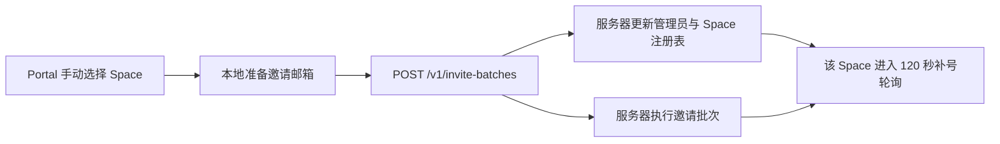
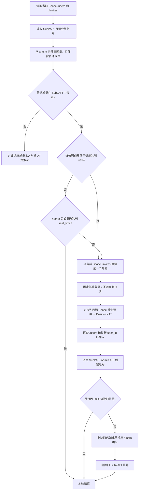

# Space 自动补号最终流程

## 0. 2026-07-30 invite-executor 优化约束（待实现）

本节是最新约束；与后文及 `packages/invite-executor` 现有实现冲突时，以本节为准。当前仅完成
需求记录，尚未修改代码、部署配置或线上服务。

### 0.1 部署节点

- `invite-executor` 不再调度到 `100.64.0.126`，目标节点改为 `100.64.0.127`。
- 部署脚本、部署文档和 Kubernetes `nodeSelector` 必须同步修改，部署后验证 Pod 实际节点。
- 当前 `/data` 使用节点本地 `hostPath=/opt/invite-executor/data`。切换节点前必须把现有
  `replenishment-registry.json` 迁移到 127 的相同宿主路径，否则已托管 Space 会丢失。
- 浏览器缓存和历史调试产物不作为必须迁移的数据；只保留托管注册表及运行必需配置。

### 0.2 浏览器注册日志

- 服务端托管继续使用浏览器完成账号登录或注册。
- 禁止输出大批量 debugger 日志、逐次轮询日志、完整 HTML、请求/响应正文、Cookie、Token
  和浏览器上下文转储。
- 每个补号周期只保留简要结构化日志：`external_space_id`、邮箱、业务阶段、开始/结束时间、
  耗时、最终状态、错误码和截断后的错误摘要。
- 正常成功路径不生成逐阶段截图。失败截图是否完全关闭，或每个失败账号最多保留一张，实施前确认。

### 0.3 席位语义与轮换上限

- `seat_limit` 继续从远端 Space 席位信息获取，不固定为 `3`。
- `seat_limit` 的业务语义改为“普通成员席位”，**不包含管理员**；稳定状态普通成员数不得超过
  `seat_limit`。
- 额度替换顺序改为“先剔除旧成员，再补新成员”；正常执行不再依赖新旧成员重叠。
- 所有容量判断只比较“远端普通成员数”和 `seat_limit`，不再使用固定的 3/4 数字，也不再使用
  `floor(seat_limit * 1.5)` 或其他重叠上限算法。
- 管理员始终排除在授权、推送、额度检查和替换对象之外。

额度达到阈值后的固定顺序：

1. 管理员剔除旧远端成员。
2. 重查 `/users`，确认旧成员已经消失。
3. 删除旧成员在 Sub2API 中的账号。
4. 从当前 Space 的 `/invites` 选择新邮箱，完成登录或注册、Codex OAuth 和下游推送。
5. 补号或推送失败时保留空席位，下一个周期从远端现状继续补号，不恢复已剔除的旧成员。

### 0.4 授权方式与异常分支

- 新成员不再创建 90 天 Business AT；改为执行现有 Codex OAuth 授权流程，并把 Codex OAuth
  凭证按现有 Codex 下游格式推送到 Sub2API。
- 浏览器登录/注册完成后再进入 Codex OAuth；不得在账号登录或注册前提前领取手机号。
- Codex OAuth 命中 `add-phone` 时，才调用
  `https://api.grizzlysms.com/stubs/handler_api.php` 获取号码和验证码。
- GrizzlySMS 按 HeroSMS 兼容协议接入，固定使用 `service=dr`、`country=187`、
  `maxPrice=0.18`；API Key 通过独立环境变量注入，不写入注册表或日志。
- Codex OAuth 命中 `select-channel` 时，不降级为 Business AT，也不推送该成员：管理员剔除
  该远端成员，重新调用 `/users` 确认成员已消失，然后从当前 Space 的 `/invites` 选择下一个
  邮箱继续补号。
- `select-channel` 剔人失败或远端确认仍存在时，本周期停止；不得继续新增成员，下一周期重试。

### 0.5 实施前待确认

1. 浏览器失败产物是完全禁止截图，还是允许每个失败账号最多保留一张截图并设置自动清理期限。
2. GrizzlySMS 的验证码等待时长和取号重试次数；API Key 后续提供。

## 1. 唯一执行边界

只有一套流程：

1. 本地 Portal 由运营手动选择一个 Business Space，准备邮箱并调用服务器邀请接口。
2. 同一个邀请请求把该 Space、管理员登录态、席位和凭证类型注册到服务器。
3. 邀请提交完成后，该 Space 的补号、额度监控、替换和剔人全部由服务器常驻进程执行。
4. 后续新增管理员或 Space 时，再从本地手动发起一次该 Space 的邀请即可动态接入，不重启服务器。

本地 `automation.space_auto_replenish` 不属于这套最终执行路径，应保持关闭。服务器不依赖
本地 Job、Work、本地数据库或 Redis 才能继续补号。



## 2. 本地手动邀请

本地空间列表对每个活动中的 Business Space 显示“服务端邀请”按钮。确认后在同一事务中开启该
Space 的服务端自动补号，并创建固定 1000 个邮箱的邀请 Job；该按钮继续使用现有邮箱选取逻辑：

1. Space 必须是 `business + active`，并且已经指定自己的 `source_admin_session_id`。
2. 只选择本地 `space_replenish_emails` 中 `source_type = local_inventory` 的补号邮箱，不再从 `user_accounts` 选择账号邮箱。
3. 补号邮箱必须是 `space_id IS NULL + invite_status = available`，且对应账号不能已属于任何 Space。
4. 不同 Space 通过数据库行锁避免领取同一个邮箱。
5. 必须凑足 1000 个，再调用服务器 `POST /v1/invite-batches`；库存不足时整个 Job 失败，不回退到账号表补齐。

邀请请求除原有字段外，增加 `replenishment`：

```json
{
  "external_space_id": "workspace-id",
  "access_token": "该 Space 的管理员 workspace token",
  "cookie_header": "管理员 Cookie Header",
  "emails": ["first@example.com"],
  "replenishment": {
    "admin_key": "admin@example.com",
    "admin_email": "admin@example.com",
    "name": "workspace-name",
    "enabled": true,
    "credential_type": "team_monthly",
    "seat_limit": 999
  }
}
```

如果本地管理员只有 `session_token`，提交前将其补为
`__Secure-next-auth.session-token=<token>` Cookie。服务器不需要回查本地管理员表。

## 3. 多管理员与动态 Space

服务器注册表将管理员和 Space 分开保存：

| 层级 | 保存内容 | 唯一键 |
| --- | --- | --- |
| 管理员 | 邮箱、用户 ID、Cookie Header、固定管理员代理 | `admin_key` |
| Space | 外部 Space ID、名称、启停、凭证类型、席位上限、自己的 workspace token、管理员引用 | `external_space_id` |

规则：

- 多个管理员互相独立。
- 同一管理员可以管理多个 Space，共享一份 Cookie 和一个稳定管理员代理。
- workspace access token 跟 Space 走；同一管理员新增第二个 Space 时，不会覆盖第一个 Space 的 token。
- 同一个 Space 再次邀请时执行 upsert，更新管理员 Cookie、Space token、席位和启停状态。
- 新 Space 注册后立即进入内存调度集合；最迟在下一个 120 秒周期执行，不需要重启。
- 可用 `PUT /v1/replenishment/spaces/{external_space_id}` 单独新增或更新配置。
- 可用 `DELETE /v1/replenishment/spaces/{external_space_id}` 删除配置；运行中的 Space 拒绝删除。

## 4. 持久化与重启

服务器不新增数据库。动态配置原子写入：

```text
/data/replenishment-registry.json
```

- 文件权限固定为 `0600`。
- 虚拟机 Docker 将 `/opt/invite-executor/data` 绑定到容器 `/data`。
- 容器重启后先加载全部管理员和 Space，再启动轮询。
- 邀请批次进度仍只保存在内存；管理员与 Space 配置不随重启丢失。
- 管理接口和状态接口不返回 Cookie、token 或代理密码。

## 5. 服务器补号周期

每 120 秒扫描一次所有 `enabled = true` 的 Space。不同 Space 可并行，同一 Space 同时最多
运行一个周期。每个周期最多创建并推送一个新账号：



管理员只提供 Space 管理登录态，不进入 Sub2API 推送、额度判断或替换。Sub2API 中存在管理员账号或
已经不在远端 `/users` 的孤立账号，都不能触发新增成员。

当前 Space 的 `/invites` 已由邀请阶段完成邮箱隔离。补号阶段直接使用该列表，不再查询其他
Space，也不重复校验候选邮箱是否被其他 Space 占用。

额度判断直接读取 Sub2API 已维护的使用快照：

- `team_5h_weekly`：`codex_7d_used_percent`
- `team_monthly`：`codex_primary_used_percent`
- 快照超过 2 小时不用于触发替换。
- 达到或超过 90% 才进入替换。

## 6. 席位与恢复规则

- `seat_limit` 是包含管理员的总席位；普通补号使用 `/users` 总成员数与 `seat_limit` 比较。
- 远端普通成员在 Sub2API 中不存在时，只推送该成员本人，不从 `/invites` 新增成员。
- 替换过程：新旧账号可短暂共存，但成员数不得达到 `floor(seat_limit * 1.5)`。
- 新账号先成功写入 Sub2API，再剔除旧远端成员。
- 剔人后必须重查 `/users`；旧用户仍存在时不删除旧 Sub2API 账号。
- 新 Sub2API 账号记录被替换的旧 user ID。进程在推新和删旧之间重启时，下轮先恢复该替换。
- Sub2API 有账号但远端 `/users` 已不存在时，不触发补号或替换。

## 7. 代理归属

- 管理员请求使用 `admin:{admin_key}` 绑定稳定 Backbone 代理。
- 同一管理员的多个 Space 共用管理员代理。
- 账号登录、注册、切换 Space 和创建 AT 使用 `account:{email.casefold()}` 绑定稳定代理。
- 不同 Space 的运行状态、候选选择和 10 秒 Business AT 限速按 `external_space_id` 隔离。

## 8. 运行与检查接口

| 操作 | 接口 |
| --- | --- |
| 本地提交邀请并动态注册 | `POST /v1/invite-batches` |
| 查询所有 Space 状态 | `GET /v1/replenishment/spaces` |
| 手动触发一个 Space 周期 | `POST /v1/replenishment/spaces/{external_space_id}/run` |
| 单独新增或更新 Space | `PUT /v1/replenishment/spaces/{external_space_id}` |
| 删除 Space 配置 | `DELETE /v1/replenishment/spaces/{external_space_id}` |
| 健康检查 | `GET /health` |

`GET /health` 中：

- `auto_replenishment.dynamic_registration = true` 表示动态注册已启用。
- `configured_space_count` 是服务器当前接管的 Space 数量。
- `active_space_count` 是当前正在排队或运行补号周期的 Space 数量。
- `startup_state` 为 `preparing` 时正在安装或验证 Camoufox；只有变成 `ready` 后才启动补号轮询。
- `startup_error` 记录最近一次浏览器运行环境准备错误；准备失败后每 30 秒重试。

## 9. 部署约束

启用服务器补号至少需要：

- `INVITE_EXECUTOR_AUTO_REPLENISH_ENABLED=true`
- `INVITE_EXECUTOR_AUTO_REPLENISH_REGISTRY_PATH=/data/replenishment-registry.json`
- Sub2API Admin API 地址、密钥和目标分组 ID
- 邮箱验证码 API 地址和密钥
- Webshare Backbone 下载地址
- 虚拟机宿主目录 `/opt/invite-executor/data`，归属 UID/GID `10001`

启动时允许注册表为空。第一条本地人工邀请会动态注册第一个 Space，之后新增管理员或 Space
继续通过相同入口接入。
