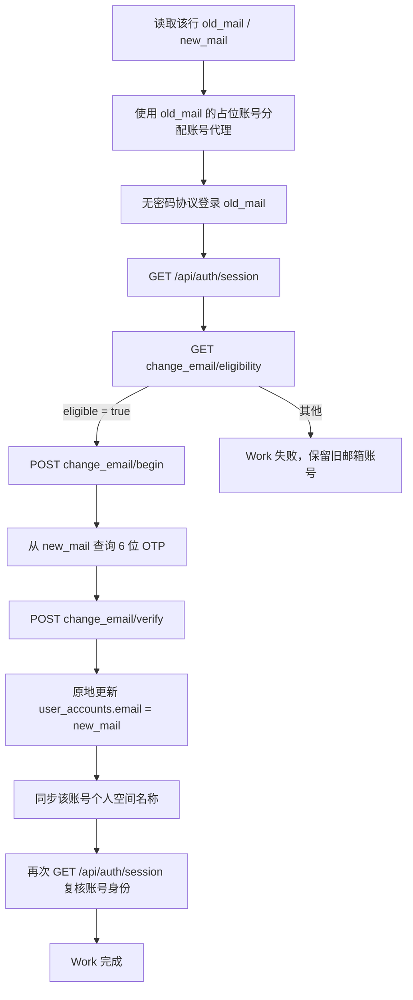

# 账号邮箱换绑

## 1. 输入

运营上传 CSV，字段固定为：

```csv
old_mail,new_mail
registered@example.com,replacement@example.com
```

- 每一行独立生成一个 Work。
- 严格按行配对，不排序，不跨行匹配。
- 邮箱原始大小写保留；重复判断不区分大小写。
- 空值、同邮箱、重复旧邮箱、重复新邮箱、两列集合交叉均拒绝创建任务。
- CSV 中任意邮箱已存在于 `user_accounts` 时，整批拒绝创建。

## 2. Job 与 Work

- Job：`account.change_email.bulk`
- Work：`account.change_email.one`
- 创建接口：`POST /account-email-change/jobs`
- 创建 Job 时直接解析 CSV、创建旧邮箱占位账号并生成全部 Work。
- `work_count` 只控制同时执行的 Work 数量，不改变 CSV 行数和 Work 总量。

## 3. 单个 Work 流程



登录、换绑资格检查、发码和验证码提交始终使用同一个账号代理。换绑接口同时携带：

- ChatGPT Web Session cookie
- `Authorization: Bearer <GET /api/auth/session 返回的 accessToken>`

不携带 `chatgpt-account-id`，不传 `remove_social_subs`。

## 4. 数据状态

- 创建任务：新增旧邮箱占位账号，`account_status = registering`。
- 旧邮箱登录成功：同一账号改为 `active`；后续换绑失败仍保留该旧账号及登录态。
- `verify` 返回 2xx：远端换绑视为已提交，直接更新同一条 `user_accounts`，不删除重建。
- 更新时保留 `user_accounts.id`、代理绑定、`openai_user_id`、空间成员和凭证关系。
- 同步更新该账号拥有的 personal space 名称为新邮箱。
- `verify` 后 Session 复核失败：换绑结果仍保留，Work 输出 `post_session_status=failed` 供运营定位。
- 前后 Session 的 OpenAI user ID 不一致：账号 Session 标记为 `error`，Work 失败。

## 5. 异常规则

- 上游要求密码：该 Work 失败，错误保留为 `login_password_required_by_upstream`。
- 资格不通过：不调用 `begin`，保留旧邮箱账号。
- 新邮箱 OTP 使用验证码接口的 `code_source=all` 查询；超时或查询失败时不调用 `verify`，保留旧邮箱账号。
- `begin` 或 `verify` HTTP 失败：Work 失败并保留上游错误。
- 取消任务：尚未启动的 Work 对应 `registering` 占位账号会删除；已登录或已完成的账号保留。
