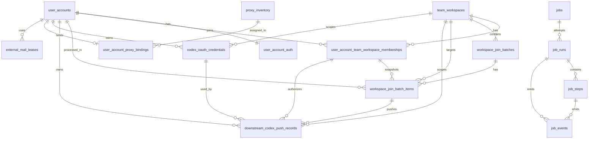
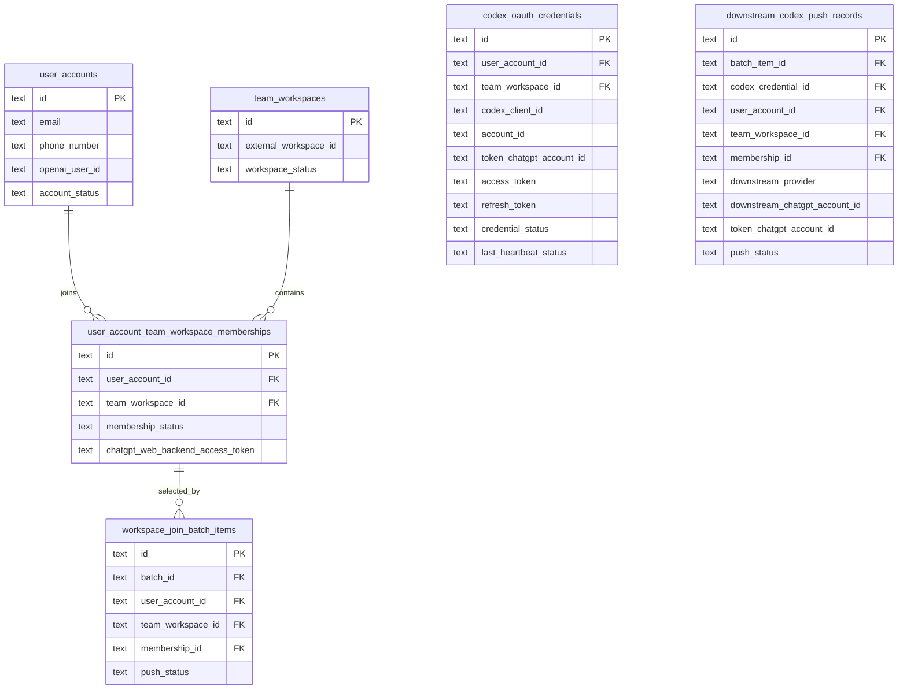
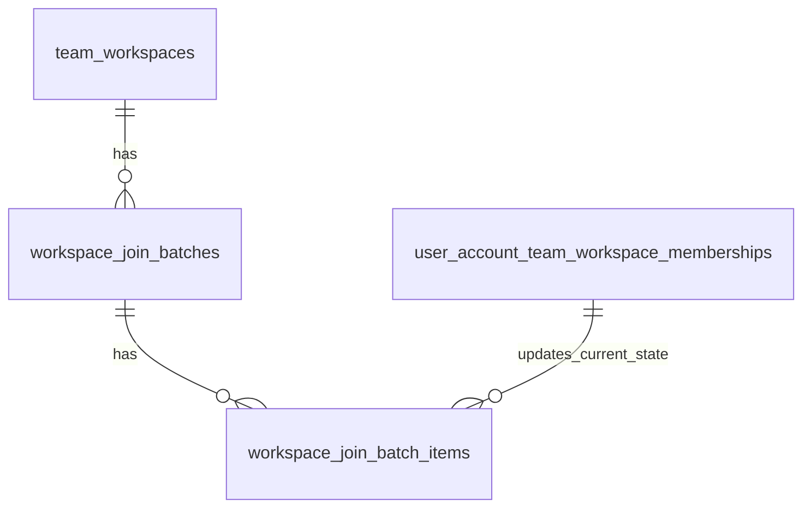

# Refactor Schema ER

本文档对应：

```text
docs/schema/001_initial_schema.sql
```

数据库目标：

```text
PostgreSQL 16+
```

## 1. 核心关系



## 2. Entity 摘要

### user_accounts

系统管理的 ChatGPT/OpenAI 账号主体。

关键字段：

```text
id
email
phone_number
openai_user_id
account_status
```

### user_account_auth

账号级登录/OAuth 凭证。

一账号一行：

```text
user_accounts 1 -> 1 user_account_auth
```

保存：

```text
session_token
refresh_token
refresh_token_status
```

不保存 ChatGPT Web backend Team Workspace API access token。
该 token 按 Team Workspace 维度保存在 `user_account_team_workspace_memberships`。

### team_workspaces

ChatGPT Team 工作区。

关键字段：

```text
id
provider
external_workspace_id
seat_limit
workspace_status
```

V1 中：

```text
provider = openai_chatgpt
```

它不是用户维护字段，只用于明确外部来源和唯一约束。

`external_workspace_id` 对应 OpenAI/ChatGPT 侧 `chatgpt_account_id` / `team_id`。

### user_account_team_workspace_memberships

User Account 和 Team Workspace 的当前关系状态。

核心唯一约束：

```text
UNIQUE(user_account_id, team_workspace_id)
```

保存：

```text
membership_status
invite_permission
seat_status
can_invite
chatgpt_web_backend_access_token
chatgpt_web_backend_id_token
```

它是当前状态表，不是批次流水表。

### workspace_join_batches

一次批量加入/生成 token/推送下游的批次。

同一个 Team Workspace 默认只允许一个 active batch：

```text
UNIQUE(team_workspace_id) WHERE activation_status = 'active'
```

状态拆分：

```text
batch_status       执行状态
activation_status  生效状态
```

### workspace_join_batch_items

批次里的单账号执行记录。

核心唯一约束：

```text
UNIQUE(batch_id, user_account_id, team_workspace_id)
```

记录：

```text
join_status
token_status
push_status
generated_chatgpt_web_backend_access_token
generated_chatgpt_web_backend_id_token
plan_tag
plan_type
downstream_provider
downstream_external_id
```

### codex_oauth_credentials

当前可复用的 Codex OAuth token。

这张表只保存 token 当前值和 token 归属校验结果。  
CPA/Sub2API 的包装字段在推送时由 worker 组装，不落库。

保存：

```text
access_token
id_token
refresh_token
account_id
expires_at
last_refresh_at
last_heartbeat_status
```

多 Team Workspace 单独授权依赖：

```text
token_chatgpt_account_id == team_workspaces.external_workspace_id
```

未过期且 workspace 匹配时可以复用，不要求每次推送都重新拉取。

字段边界：

```text
account_id:
  ChatGPT/OpenAI User Account 外部账号 ID。
  不是本系统 user_accounts.id，也不是 Team Workspace ID。

token_chatgpt_account_id:
  从 access_token JWT 解析出来的实际 workspace/account 上下文。
  用来校验是否等于 team_workspaces.external_workspace_id。
```

不保存：

```text
email:
  从 user_accounts.email 读取。

type=codex:
  固定常量。

platform=openai / type=oauth:
  Sub2API 包装常量。

name:
  推送时按 codex-{md5(email)[:8]}-{email}-{plan_tag}.json 生成。

token_source:
  CPA 推送时按 ChatGPT_{plan_tag} 生成。

membership_id:
  credential 的唯一业务作用域已经是 user_account_id + team_workspace_id + codex_client_id。
  workspace_join_batch_items 和 downstream_codex_push_records 保存当次批次使用的 membership_id。
```

### downstream_codex_push_records

CPA/Sub2API 的 Codex 凭证包推送记录。

唯一条件：

```text
UNIQUE(batch_item_id, downstream_provider)
```

含义：

```text
同一批次 item 推同一个下游，只保留一条 push record。
重试时 upsert 这一条，不追加多条。
```

核心关联字段：

```text
batch_item_id
codex_credential_id
user_account_id
team_workspace_id
membership_id
downstream_provider
```

字段要求：

```text
batch_item_id:
  必填。

user_account_id / team_workspace_id / downstream_provider:
  必填。

membership_id:
  推送 workflow 输入必须有 membership_id。
  表字段允许为空是为了 membership 被删除时 ON DELETE SET NULL 后保留历史推送记录。

codex_credential_id:
  credential 构建成功后必须写入。
  如果在 credential 构建前已经 upsert pending 记录，或 credential 构建失败，则允许为空。
```

快照字段：

```text
codex_client_id
codex_account_id
codex_email
downstream_chatgpt_account_id
token_chatgpt_account_id
codex_token_expires_at
push_status
downstream_external_id
```

这些字段是推送发生时从 `codex_oauth_credentials`、`team_workspaces`、`user_accounts` 复制出来的审计快照。  
当前 token 仍以 `codex_oauth_credentials` 为准。

`downstream_chatgpt_account_id` 是本次实际推给 CPA/Sub2API 的 workspaceId 语义字段。  
正常值必须等于 `team_workspaces.external_workspace_id`。

多 Team Workspace 单独授权依赖：

```text
token_chatgpt_account_id == team_workspaces.external_workspace_id
```

不一致时：

```text
push_status = failed
error_code = workspace_mismatch
```

### proxy_inventory

Webshare IP 池。

V1 只允许：

```text
provider = webshare
```

### user_account_proxy_bindings

账号和代理的绑定关系。

核心唯一约束：

```text
UNIQUE(user_account_id)
```

代理绑定在 User Account 上，不绑定在 Job/Step/单次请求上。

### external_mail_leases

外部邮箱接口租约记录。

V1 只允许：

```text
provider = external_mail_api
```

本服务不维护邮箱账号、IMAP、Cloudflare KV、catch-all 域名。

### jobs / job_runs / job_steps / job_events

持久化任务执行体系。

层级：

```text
jobs
  -> job_runs
    -> job_steps
    -> job_events
```

## 3. 多 Team Workspace + Codex 推送关系



流程约束：

```text
1. 构建 Codex token 必须输入 team_workspace_id。
2. Worker 读取 team_workspaces.external_workspace_id。
3. Worker 先查 `codex_oauth_credentials` 是否有 active、未过期、workspace 匹配的 credential。
4. 没有可复用 credential 时，Worker 才构建目标 workspace 的 Codex token 并 upsert `codex_oauth_credentials`。
5. Worker 解 access_token 得到 token_chatgpt_account_id。
6. token_chatgpt_account_id 必须等于 external_workspace_id。
7. 通过后才能推 CPA/Sub2API。
```

## 4. 批次生效关系



批次状态不是当前 membership 状态：

```text
workspace_join_batches:
  记录一次批量执行及是否生效。

workspace_join_batch_items:
  记录某个账号在本批次中的执行结果。

user_account_team_workspace_memberships:
  记录当前状态和当前可用 ChatGPT Web backend API token。
```

## 5. 约束来源

当前 ER 来自以下文档：

```text
docs/00-glossary.md
docs/02-capability-model.md
docs/03-architecture.md
docs/04-tech-selection.md
```
